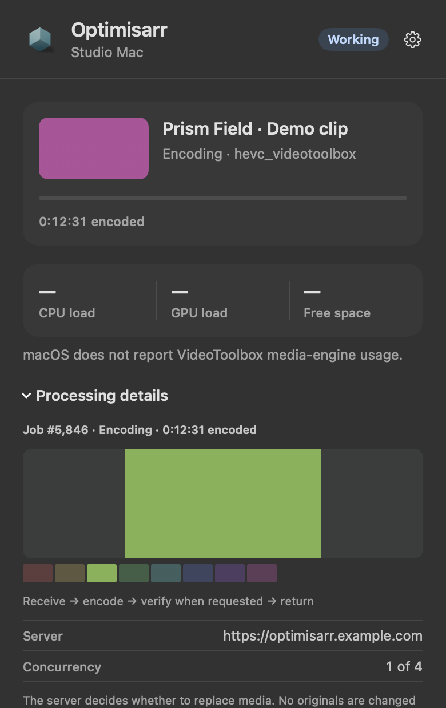
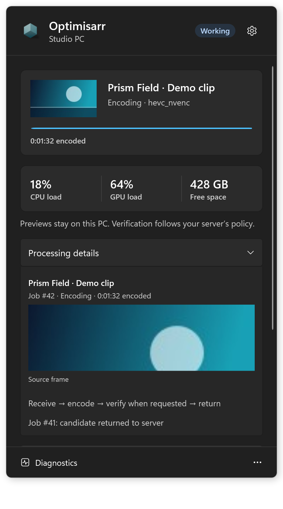
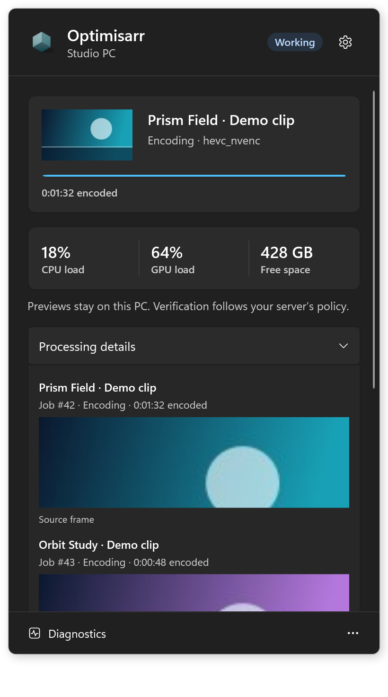
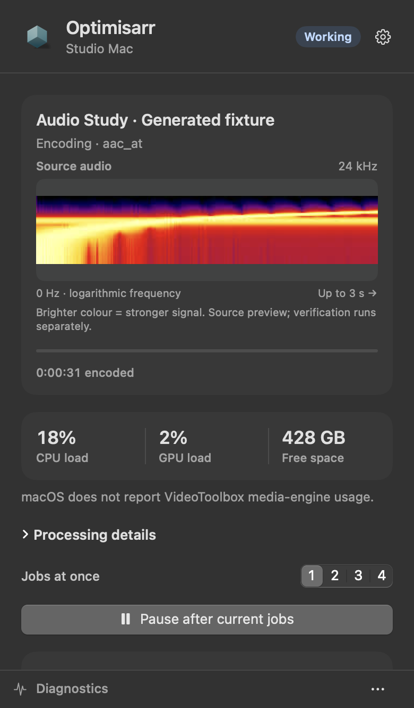
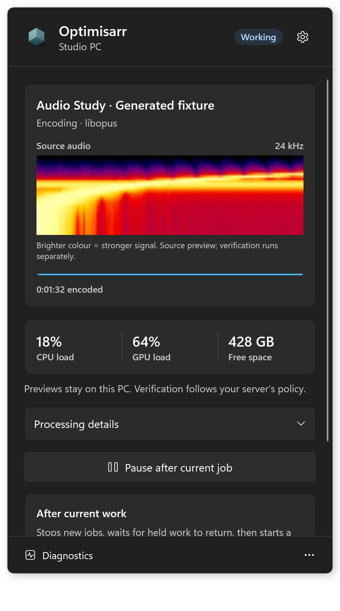

# Compact Monitor — Windows tray and Mac menu bar

The selected direction is **3 · Compact monitor**. The [native comparison](native.html) shows current native dark/light activity panels,
Processing details and Preferences, including the Precession icon. The three original interactive studies live
in `index.html`; their job data and proposed controls are simulated. Production native views use
real capabilities and readings instead.

Each client is drawn by its own platform, so it looks at home there: native SwiftUI controls and
system colours on the Mac (glass buttons and the glass popover on macOS 26, bordered controls
before it), and WPF's Fluent theme on Windows 11. Both follow the system's light/dark appearance,
accent and contrast settings; progress motion respects the system animation preference.

What the two share is everything a person reads: the order of the panel, its wording, the three
readings (**CPU load**, **GPU load**, **Free space**), the stage line under a job title ("Encoding ·
hevc_nvenc"), the line under the progress bar ("0:12:31 encoded") and the status chip. The chip's
colours are the web interface's tones, chosen to stay apart under colour-blindness: success is blue
rather than green. Both clients write those values exactly as `web/src/app.css` does, and
`scripts/tests/test_sidecar_theme.py` fails if either drifts.

| Meaning | Chip | Tone | Platform |
| --- | --- | --- | --- |
| A job is running | Working | ok (blue) | both |
| Connected, waiting for work | Ready | ok (blue) | both |
| New jobs paused | Paused | info (graphite) | both |
| Shutdown armed | Shutdown armed | warn (gold) | both |
| Server cannot be reached | No server | warn (gold) | both |
| Not paired | Not paired | info (graphite) | both |
| Worker disabled on the server | Stood down | warn (gold) | Mac |
| Pairing in progress | Pairing | info (graphite) | Mac |
| Pairing rejected | Pairing failed | bad (raspberry) | Mac |
| Worker revoked | Revoked | bad (raspberry) | Mac |
| Tray cannot reach the local worker | Worker offline | bad (raspberry) | Windows |
| Worker service stopped | Stopped | warn (gold) | Windows |
| Worker service faulted | Needs attention | bad (raspberry) | Windows |

Pause and an armed shutdown outrank the connection state, because they say what the machine will
do next. The platform-only rows reflect states the other client cannot reach.

The panel leads with the current title and stage, then three live readings, expandable processing
details, a pause control, and nested Preferences/Diagnostics. No dashboard window is created.
Pairing may open a focused setup window (elevation is required for machine-wide Windows pairing).

## Platform differences that reflect real capabilities

- Mac retains its frame previews, film strip, one-to-four-job setting, work-location settings,
  login item and native menu-bar status icon. Preferences now opens within the popover. CPU/GPU are
  real readings; macOS does not expose VideoToolbox media-engine utilisation. The third reading
  is free work-volume space, as last reported to the server. The full film strip is under
  Processing details.
- Windows gets a separate WPF tray companion using `NotifyIcon`. Work stays in the Windows
  service. The panel receives a credential-free snapshot over a local named pipe, and shows CPU,
  GPU and working-space capacity. Current assignments contain no artwork, so the media well
  honestly uses a film placeholder. The service currently accepts one job at a time; speculative
  Quiet/Balanced/Full preset controls are not shipped.
- No encode percentage or ETA is invented: the worker does not have an authoritative total
  duration. Encoding uses an indeterminate activity indicator with the encoded time under it;
  only a Mac transfer, whose size is known, shows a percentage.
- Pause gates new claims, keeps heartbeat/lease renewal alive, and lets held jobs finish. A claim
  already in flight when paused is handed back. Pause resets when the worker/app restarts; the UI
  says so. On Windows, quitting the tray leaves the service running; quitting the Mac sidecar
  hands current jobs back using its existing shutdown path.

## Anchoring and application identity

The Mac panel uses an AppKit `NSPopover` anchored to the status item. Changes to processing details,
preferences, or diagnostics resize that same popover, retaining its menu-bar position and rounded
surface. It cannot detach into an independent window. Windows positions its transparent, rounded
WPF monitor inside the selected screen's working area using physical coordinates, recalculating
on resize or DPI changes. It is not always on top and closes when focus moves elsewhere or Escape
is pressed.

Both platforms use the web application's Precession artwork. The Windows executable, notification
icon, MSI/Start shortcut and monitor header carry that identity; the Mac package, status item and
header use matching art. The native icon artwork is static, while processing indicators reflect
actual work. Native tests exercise expansion/collapse and navigation to prevent geometry regressions.

## Review and verification

The native renderers exercise idle, encoding, receiving/delivering, verification, disconnected,
and multi-job states as appropriate. They pose data and never pair or run jobs. Windows renders
are uploaded by the existing sidecar CI job. Mac snapshots use an actual AppKit hosting view so
native controls, scroll views and menus are included. A snapshot cannot show glass (the window
server composites it), so the Mac renderer draws the bordered buttons glass falls back to, over the
system window background.

Review corrections include offline/disabled state wording, clearing unavailable Windows readings,
removing stale server-verification wording, a pause
race during network claims, and framing/acknowledging local pipe replies before disconnecting.
Tests cover the race, pause preserving active work, safe server links, query redaction, status
presentation, local pipe round trips and Windows access rules.

The Windows pipe accepts only read/pause/resume bytes, bounds reply sizes and connection time,
permits local interactive users, and denies network logon tokens. It cannot accept arbitrary
commands or paths and never sends the worker credential. Pairing and starting the service remain
administrator actions.

The MSI is an unsigned development preview; see [installer notes](../../../sidecars/windows/installer/README.md).
The selected design has been installed on the paired Mac and Windows workers. The Windows
installation used the MSI migration route and preserved the existing pairing.

## Current native screenshots

These screenshots use fabricated dummy media created for documentation, invented machine names
and example server addresses. No copyrighted media material is used. They are rendered by the
current AppKit and WPF views with isolated fixture data; no live worker is contacted.

The Windows tray now samples a small local source frame only while its activity panel is visible.
The [fallback fixture](../../images/optimisarr-sidecar-windows-preview-fallback.png) shows the
labelled state when a source preview cannot be decoded. Standalone audio now has its own measured spectrogram.

See [the native comparison](native.html) for light/dark activity and Preferences views. The
[original design studies](index.html) remain historical mockups with proposed controls, using a
fabricated geometric scene in place of real media artwork. They are not evidence of shipped features.

## Audio monitor

The audio view keeps the Compact Monitor typography, card texture, colours and
hover shadows. Its distinguishing element is a full-width measured source spectrum
with log-frequency and time labels, rather than a film thumbnail or decorative EQ
bars. It appears in the active card without opening details; missing samples have
an explicit waiting state. Preview data never contributes to verification.

Light-theme captures and the Linux phone view are retained alongside these images.
The visual review removed empty video thumbnails and duplicate Mac spectra, checked
frequency/time labels and panel bounds, and corrected the Linux workflow wording
so it no longer implies VMAF applies to music or repeats media checks on the server.
