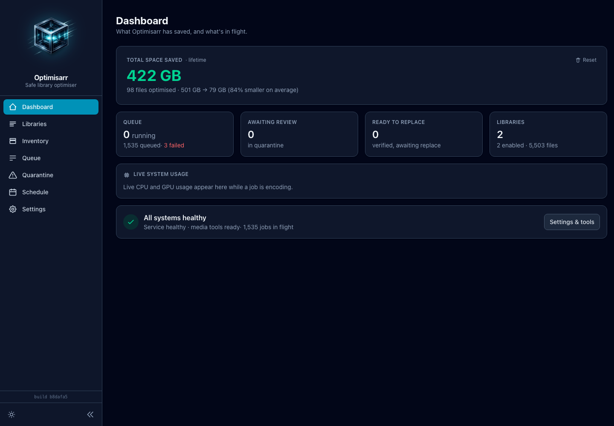

# Optimisarr documentation

Optimisarr is a safety-first media-library optimiser. It scans and queues work,
verifies each output, and keeps originals in quarantine until you approve purge.

## New users

- [Getting started](setup/getting-started.md) - deploy the container and run the first dry-run workflow.
- [User workflow](usage/workflow.md) - a friendly walkthrough of the app, from first library to quarantine review.

## Day-to-day operation

- [Safe replacement and rollback](operations/safe-replacement.md) - what has to pass before an original is moved, and how rollback works.
- [Configuration and scheduling](setup/configuration.md) - queue limits, verification gates, per-library automation, exclusions, and backup.
- [Hardware acceleration](setup/hardware-acceleration.md)
- [Running behind a reverse proxy](setup/reverse-proxy.md)
- [Media-server integrations](integrations/media-servers.md) - Plex, Jellyfin, Emby, Sonarr, Radarr, and notifications.

## Reference

- [API reference](api.md) - HTTP endpoints used by the UI and local automation.
- [OpenAPI contract](openapi.json) - generated OpenAPI 3.1 document for API tooling.
- [Glossary](glossary.md) - Optimisarr terms in plain English.
- [Documentation standard](documentation-standard.md) - how project docs should be written and reviewed.
- [Product and architecture](product-and-architecture.md)
- [Roadmap](roadmap.md)

## Troubleshooting and project information

- [Troubleshooting](troubleshooting/diagnostics.md) - health/readiness, stalled jobs, failed verification, GPU detection, and stale UI.
- [Security policy](../SECURITY.md)
- [Support](../SUPPORT.md)
- [Contributing](development/contributing.md)

## UI Map

| Screen | Use it for |
|---|---|
| Dashboard | Check service health, lifetime savings, queue counts, and live CPU/GPU usage while a job encodes. |
| Libraries | Add paths, choose presets, scan, enqueue, configure automation, review candidates, and manage exclusions. |
| Inventory | Inspect discovered files and understand why each one is eligible or skipped. |
| Queue | Watch jobs, read verification reports, retry or exclude failures, and replace verified outputs. |
| Quarantine | Compare replacements with originals, roll back, approve, or clear finished history. |
| Settings | Tune queue limits, verification gates, replacement policy, integrations, notifications, tools, and backup/import. |

## A note on screenshots

All media titles, files, and library contents shown in screenshots throughout
this documentation are fabricated dummy data created solely for demonstration.
No copyrighted material is used.
