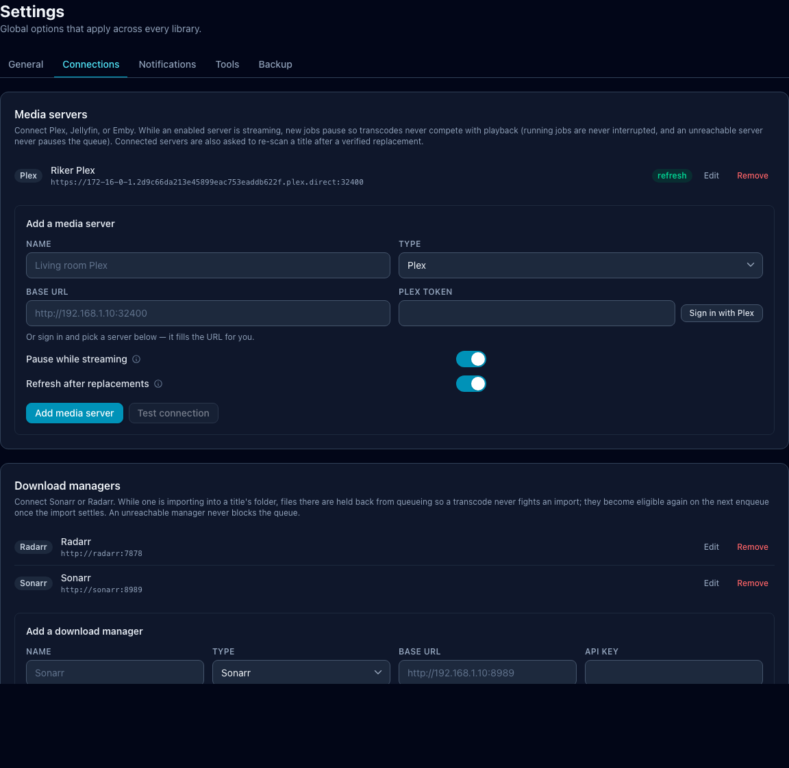

# Media-server integrations

Optimisarr supports configured Plex, Jellyfin, and Emby activity watchers to
pause new work while a service is active. Unreachable watchers do not wedge the
queue. After a replacement or rollback it asks each connected server to rescan:
a changed-folder refresh for Jellyfin/Emby, and a section refresh for Plex.

Configure integrations under **Settings → Connections**.

Screenshots in this page use fabricated dummy media created for documentation.
No copyrighted material is used.

| Service | Use it for | Connection method |
|---|---|---|
| Plex | Pause new work during active sessions; refresh libraries after replacement or rollback. | Plex sign-in/PIN flow, then choose a discovered server or enter the URL manually. |
| Jellyfin | Pause new work during active sessions; refresh changed folders after replacement or rollback. | Quick Connect or API key. |
| Emby | Pause new work during active sessions; refresh changed folders after replacement or rollback. | API key. |
| Sonarr | Avoid immediately reprocessing recently imported TV files. | Base URL and API key. |
| Radarr | Avoid immediately reprocessing recently imported movie files. | Base URL and API key. |

Test each connection before enabling it. Keep only the pause and refresh
behaviour you actually need.

## Notifications

Notification targets live under **Settings → Notifications**. Supported targets
are generic webhook, Discord, ntfy, and Apprise. Discord webhook URLs are
detected automatically and sent as embeds. Targets can notify on replacement and
on job failure.

## Backup warning

Exported configuration includes provider secrets so it can restore a working
setup. Treat the JSON file as sensitive material and never commit or share it.
