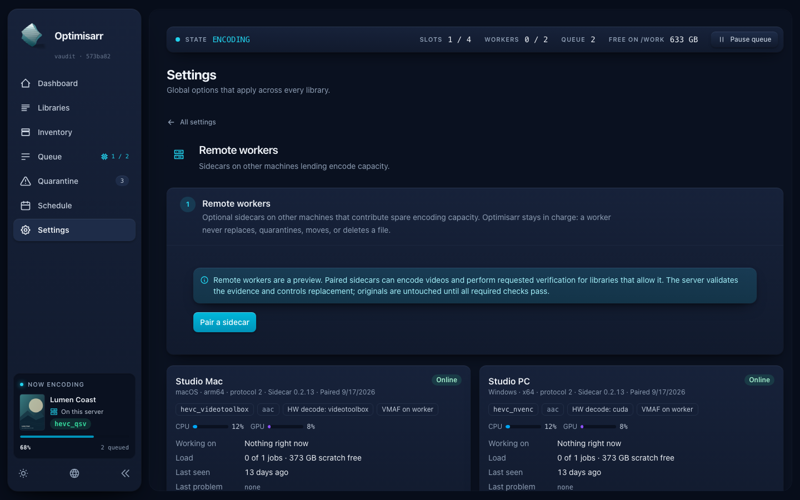

# Full application review — 30 September 2026

Optimisarr's tested media pipeline has substantial safeguards, but this review found two
high-priority defects at the boundaries between verification, file replacement, and worker
result delivery. Fix those before broadening automatic replacement. Passing suites do not
eliminate these defects: nine additional probes reproduce behaviours the existing suites
permit.

This is a risk-prioritised review of the whole application, including server, workers,
web UI, native monitors, packaging, operations, and documentation. It is not a formal
security certification, an exhaustive proof of every execution path, or a release approval.
No application fixes, production queue changes, deployments, or issue submissions were
made. Proposed fixes below are recommendations, not implemented behaviour.

## Decisions and priority

| ID | Severity | Evidence / confidence | Finding | Status |
|---|---|---|---|---|
| R1 | High | Reproduced on Mac and Linux / high | Replacement accepts source or candidate bytes changed after verification | New |
| R2 | High | Reproduced on Mac and Linux / high | In-flight result upload revives a cancelled or expired job | New |
| R3 | Medium | Reproduced on Mac and Linux / high | Tool detection can block on redirected pipes and leave a cancelled child alive | New |
| R4 | Low | Reproduced on Mac and Linux / high | Malformed persisted verification checks prevent diagnostic bundle creation | New; malformed-data prerequisite |
| R5 | Medium | Rendered accessibility scan / high | Shared sidebar progress bar has no accessible name | New |
| R6 | Medium | Rendered contrast measurements / high | Guidance and some status badges fail normal-text contrast requirements | New |
| R7 | Medium | Source confirmed; impact unmeasured / medium | Pagination/export limits are applied after large database materialisation | New scale risk |
| R8 | Low | Documentation compared with code / high | Architecture describes rollback recording after file mutation | New documentation drift |

No critical-severity issue was established. Severity expresses plausible workflow impact;
confidence expresses the strength of the evidence. Automated accessibility tool labels
such as “serious” are not substituted for this assessment.

Recommended sequence: R1 and R2 in separate safety-focused changes, R3 for process reliability,
R4 alongside ongoing diagnostics, R5–R6 as a small UI accessibility change, then R7 with
benchmarks. Correct R8 alongside R1. Keep verification gates intact while addressing these.
Do not retry all historical failures as a substitute for diagnosis.

## Baseline, method, and authority

- Source: `dev` commit **573ba821587db92b1958429b5045a376189fbe19**.
- Git tree: `597b7209423f255dd05dafb100cca4cb37bc276d`.
- Branch: `docs/application-review`, in a separate review worktree. Existing agent work
  and installed worker pairing were preserved.
- Primary execution window: 30 September 2026, approximately **21:42–22:14 UTC**;
  portable reproduction and documentation validation followed on the same date.
- Local tools: .NET SDK 10.0.302, Node 26.5.1, Python 3.14.6, Swift 6.4.
  Native Linux used .NET SDK 10.0.300. Mac media tests used bundled FFmpeg/ffprobe 8.0.3.
- Review instruction: [complete researched application review prompt](../development/application-review-prompt.md).

The review followed the repository engineering and documentation standards and workspace
host runbooks. It traced contracts and failure paths, ran the normal gates, then used
isolated reproductions for suspected defects. Design/functionality/testing/documentation
coverage follows [Google's review checklist](https://google.github.io/eng-practices/review/reviewer/looking-for.html).
Reproductions and independent output checks address the false-positive and missed-defect
limits described by [GitHub's responsible code-review guidance](https://docs.github.com/en/copilot/responsible-use/code-review).
The use of outcome checks and negative cases draws on
[Anthropic's agent evaluation guidance](https://www.anthropic.com/engineering/demystifying-evals-for-ai-agents).
This is a project-specific synthesis, not a claim that these sources endorse the findings.

A second pass challenged reachability, fixture limitations, guards elsewhere, prior fixes,
and proposed-fix consequences. That pass was performed by the same agent. It is not an
independent reviewer or human sign-off. The reusable prompt supports a later fresh review.

### Threat model and live boundaries

The server UI/API are administrative surfaces. The deployment assumes a trusted operator,
protected remote access, and worker credentials scoped to the worker protocol. Review
attention included malicious file paths/metadata, stale or compromised workers, interrupted
transfers, external media-manager writes, database corruption, and diagnostic privacy.
Configurable tool commands are operator-controlled; R3 is a reliability issue rather than
an established remote command-execution vulnerability.

Production was observational. Tests used isolated data and generated media. The only live
container execution was finite, bounded synthetic encode/decode/VMAF work in owned temporary
paths, followed by cleanup. No queue retries, replacements, approvals, settings changes,
capture enablement, worker drains, restarts, upgrades, wake requests, or shutdowns occurred.
Raw operational evidence stays in the private workspace evidence directory. This report
contains no private library names, media paths, host addresses, or credentials.

### Installed state versus reviewed source

| Endpoint | Observed state | Provenance and limit |
|---|---|---|
| Riker server container | Healthy; ready; version 0.2.17.0; zero recorded restarts | Image `sha256:41ee0a530dd48b00e238b148285eb5de659f6719ea24f1ad0358a8d9d23f939d`; visible semantic version alone is not a Git revision |
| Quark Linux sidecar container | Online; healthy; zero recorded restarts; protocol 4 | Image `sha256:bd40406bff4b3ce296f04cf8e01ad02ff0abc4102a1c1693e5aa5a73108dc35a`; earlier worker build, not newly rebuilt for this review |
| Installed Mac sidecar | Online; protocol 4; 0.2.17, numeric build 202609301618 | Hardware acceptance used a separately compiled worker from the pinned review source |
| PICARD Windows sidecar | Offline; registered protocol 4, version 0.2.17+8a70298… | SSH unreachable; registered metadata is not proof that the current binary is running |

The server image digest is recorded to identify the observation; readiness/version endpoints
do not prove the full source revision by themselves. Installed workers and the reviewed
checkout have different provenance. Fresh source-suite results must not be represented as
proof of every installed native binary.

At both observational snapshots, jobs were **1,687 completed, 43 failed, 89 cancelled, and
6 awaiting size review**. No active jobs were present at those instants. The failed and held
job ID sets were unchanged at the end of testing. The Mac and Linux workers were online;
PICARD was offline. Existing failures were not reclassified or retried.

## Architecture and coverage ledger

The central workflow is discovery → eligibility/placement → lease or local execution →
probe/encode → verification → ready/held/failed → replacement → quarantine → rollback or
approval/purge. Worker evidence and delivered hashes cross a trust boundary; the server
still owns job state, acceptance, persistence, replacement, and quarantine bookkeeping.
Strict sidecar-only verification moves required media checks to capable workers. It does
not eliminate server transport, state transitions, filesystem operations, or control-plane I/O.

| Area | Inspected contracts | Execution / remaining limit |
|---|---|---|
| API composition and persistence | Startup migrations, pending-operation recovery, readiness, EF boundaries, job/lease states | Mac and Linux backend suites; not a power-loss durability campaign |
| Discovery and scheduling | Rescan idempotency, eligibility, capability/placement policy, fairness and work lanes | Unit coverage and selected fleet scenarios; no multi-day saturation soak |
| Worker protocol | Pairing/authentication, source access, lease ownership/renewal, candidate hash/delivery, strict verification | Shared worker tests, Mac hardware acceptance, Linux tests, new R2 probes; fresh Windows blocked |
| Media correctness | Stream mapping, timestamp/frame/duration checks, audio/subtitles, VMAF and adaptive search | Independent checks on selected synthetic SDR/VFR/offset/10-bit fixtures; not all HDR, codecs, drivers, or long files |
| Replacement and quarantine | Coordinator, pending record before move, cross-device mover, rollback/recovery, purge/dry-run | Backend coverage and R1 probes; no actual production file mutation |
| Diagnostics | Capture opt-in, redaction, attempt/evidence retention, export omissions, historical identity | Backend tests, R4 probes, open issue review; full offline worker log correlation still incomplete |
| Web UI | All 30 audited routes, child-room widths, themes, responsive geometry, dialogs, breadcrumbs, hover/focus, tooltips, progress | Chromium/WebKit audits, controlled screenshots and axe; no screen-reader user study or live API mutation tests |
| Mac native monitor | Anchored popover resize/collapse, icon activity, pairing/session, shutdown countdown, RAM lifecycle | Swift suite/release build and real RAM tests; no exhaustive multi-monitor/manual accessibility certification |
| Windows native monitor/MSI | Work-area placement, monitor IPC ACL, icons/shortcuts, upgrade pairing preservation, optional shutdown safeguards | Source and current CI; no fresh interactive Windows or MSI test on PICARD |
| Linux native/container worker | Local dashboard origins/binding, CSP, authentication flow, resource cleanup | Native Linux suite plus installed-container tool probe; no native host FFmpeg installation available |
| Security and release | Admin/worker boundaries, argument arrays, file serving, provider proxying, signing policy, workflow permissions | Source, current CodeQL/secret-scan CI, contract/release checks; no penetration test or new certificate issuance |
| Documentation | Maintained guides, prior reviews, screenshots, open issue comments, current safety claims | R8 found; this report does not imply every historical page was comprehensively rewritten |

Specific positive controls include constant-time worker credential comparison, source delivery
bound to an authenticated held lease, explicit process argument arrays, native dialog Escape
and focus restoration, immutable artwork aspect boxes, safe MSI pairing storage, bounded local
monitor responses, and a durable pending replacement record before filesystem changes.
These reduce risk; they do not negate R1–R3.

## Test results and provenance

| Test | Fresh result | Meaning / limit |
|---|---|---|
| Mac Release solution build with warnings as errors | Passed; 0 warnings/errors | Pinned server/core/data/tests |
| Mac backend suite | 2,451 passed; 0 failed/skipped | Existing suite before review probes |
| Quark native Linux Release build/backend suite | 0 warnings/errors; 2,451 passed, 0 failed/skipped | Isolated archive of pinned source |
| Python script unit tests | 64 passed | Harness and script logic |
| Frontend check/unit/build | 0 Svelte errors/warnings; 75 unit tests passed; production build passed | Source checks and assets |
| Full Chromium E2E | 193 passed | Controlled API fixtures; separate owned browser port |
| WebKit layout audit | 10 passed | Route/viewport, locale, detail-dialog and interaction coverage |
| Additional screenshot/geometry audit | 3 passed | Desktop dark, phone dark, 200% text; 65 evidence captures/measurements retained privately |
| Accessibility supplement | 2 scan runs completed; **violations found** | 30 routes each at desktop dark and phone light; not an accessibility pass |
| Swift suite and Release build | Runner reports 235 tests in 49 suites; green; conditional live tests skipped | Live timeline/server/work-loop suites remained explicitly gated |
| Mac real RAM-volume tests | 3 test declarations / 5 case executions passed | Real volume round-trip, orphan cleanup, and success/failure/cancel encode cleanup |
| Shared .NET worker core | 246 passed on Mac; 246 passed on Linux | Does not substitute for Windows native monitor tests |
| Linux sidecar suite | 29 passed on Linux; 29 passed on Mac | Linux execution is the native result; Mac execution is supplementary |
| Mac fleet media acceptance | **40 passed; 0 failed/blocked** | Separate source-built worker, local libx265 and VideoToolbox; independent output checks |
| Riker and Quark installed-container tool probes | Both exit 0; each 48 decoded frames; VMAF harmonic 97.964199 | Short CPU libx265 media sanity; not full production application acceptance |
| New backend defect probes | **9/9 reproduced on Mac and Linux** | Passing assertions demonstrate current defects, not repaired behaviour |
| OpenAPI / release metadata checks | Passed | Current generated contracts and version metadata |
| PICARD Windows / MSI / NVIDIA execution | **Blocked: host unreachable** | No new Windows certification |

The Swift summary cannot be read as “235 live integrations executed.” Its full run explicitly
skips the timeline alignment, real-server pairing, and work-loop tests gated by additional
environment variables. The separate Mac fleet acceptance supplies real worker/server/media
integration for its selected matrix, rather than pretending those skips were passes.

Mac fleet cases included worker and local adaptive encoding, timed-text conversion to
Matroska, VFR/offset/10-bit fixtures, hardware decoding, impossible-quality rejection,
independent VMAF, decode integrity, rollback hash restoration, audio/image checks,
cancellation, reconnect, unavailable-worker placement, concurrent isolation, and scratch
cleanup. Negative oracle cases rejected black, dropped, and truncated outputs. These are
short generated fixtures, not whole-library or universal hardware certification.

Current pinned-source CI was also green: [main CI](https://github.com/Jellman86/optimisarr/actions/runs/36775871847),
[Linux sidecar](https://github.com/Jellman86/optimisarr/actions/runs/36775871874),
[CodeQL](https://github.com/Jellman86/optimisarr/actions/runs/36775871801), and
[secret scan](https://github.com/Jellman86/optimisarr/actions/runs/36775871890).
Windows CI is useful native evidence, but does not establish current PICARD tray behaviour,
installed MSI upgrades, or RTX 4070 execution during this review.

## Detailed findings

### R1 — Replacement must verify the identity of the bytes it is about to move

**High; reproduced; new.**
[ReplacementService](https://github.com/Jellman86/optimisarr/blob/573ba821587db92b1958429b5045a376189fbe19/src/Optimisarr.Api/Replacement/ReplacementService.cs#L246)
checks verified state and file existence, then obtains current lengths and moves files.
It does not bind those current files to the original source hash and the candidate bytes
that earned verification. A move/copy integrity check can prove that a current file copied
correctly without proving that it is the file previously verified.

Two isolated tests seed a ready, verified job and then change bytes:

1. Candidate `VERIFIED!` becomes same-length `CORRUPT!!`, with the original delivered hash
   retained on its completed worker lease. Replacement returns success and places the changed
   candidate at the final path.
2. The source hash identifies `ORIGINAL-DATA`; an external write changes the source to
   `UPGRADED-DATA` before replacement. Replacement still succeeds, placing the old candidate
   and quarantining the newer source.

The expected result is refusal before any original is moved. These are small text fixtures
at the replacement boundary, not an FFmpeg media test. They deliberately isolate whether
verified identity is enforced. Originals remained in quarantine in both probes; irreversible
loss was **not** observed. Real exposure includes a media-manager upgrade or work-file change
between verification and automatic/manual replacement. Later approval/purge would remove
rollback ability, so quarantine retention is not a substitute for identity enforcement.

**Possible fix:** persist expected source and candidate hashes/identity with the verified
attempt, validate before mutation, and bind the pending replacement record to that identity.
Use exclusive handles or equivalent identity revalidation across the actual move/copy
boundary. Merely hashing and then reopening a path introduces another check/use race.
Missing historical identity should require explicit re-verification, not blind acceptance.

**Regression criteria:** changed source, changed candidate, same-length corruption, external
rename/swap, local and worker output all refuse without moving the source. Preserve normal,
duplicate, cross-filesystem, cancellation, rollback, and crash recovery behaviour.

**Second-order assessment:** the replacement coordinator does not lock out external media
managers. The current mover protects copy integrity, not prior verification identity.
Extra hashing adds I/O and can affect large libraries; define strict sidecar-only semantics
clearly without silently reintroducing server codec/VMAF work. Schema/recovery changes must
be migrations-only and backwards-safe. Do not relax gates to compensate for the added checks.

### R2 — Result acceptance must revalidate a live lease atomically

**High; reproduced; new.**
[WorkerResultEndpoints](https://github.com/Jellman86/optimisarr/blob/573ba821587db92b1958429b5045a376189fbe19/src/Optimisarr.Api/Endpoints/WorkerResultEndpoints.cs#L350)
resolves a held lease before streaming the request. After the potentially long upload it
promotes the file and sets `AwaitingVerification` using tracked objects. At line 387 it applies
the lease returned by `Complete` without enforcing the outcome of that operation.

Three tests execute the registered delivery handler with a controlled request stream. On
its first read, after initial validation, the fixture either cancels the job/releases the
lease in another database context, expires the lease in that context, or waits until the
original one-second lease expires. In every case, delivery returns HTTP **202** and the job
becomes **AwaitingVerification**. Cancellation/expiry should prevent accepting that attempt.

This is endpoint execution with authenticated worker setup and an intentionally coordinated
stream, not a real network partition simulation. The tests do not replace an original, and
verification is still required. Nevertheless, cancellation can be undone and stale work can
return to the dispatcher. Candidate naming is job-based; interference with a newer attempt
is a related source-supported risk, not an additional reproduced overwrite claim.

**Possible fix:** reserve/commit delivery through a conditional state transition requiring
the current job attempt, held lease, holder, live expiry, and leased job state. Enforce the
domain completion result **before** file promotion. Couple database and file promotion with
a recoverable pending-delivery design. A simple reload followed by an unconditional save
still has a race. Consider attempt-qualified final paths and duplicate-completion ownership.

**Regression criteria:** cancellation, release, real-time expiry, reassignment and concurrent
completion cannot revive an attempt or overwrite another candidate. Legitimate lease renewal,
resumed upload, duplicate requests, interrupted promotion and recovery remain safe/idempotent.

**Second-order assessment:** current initial guards are real but stale after streaming.
Renewals must not be rejected just because a tracked snapshot differs. Cleanup must delete
only the rejected attempt's resources. Test SQLite transaction/conditional-update behaviour
and distinguish accepted bytes from verification success in API/UI state.

### R3 — Tool probes need concurrent pipe draining and process termination

**Medium; reproduced; new.**
[ToolDetectionService](https://github.com/Jellman86/optimisarr/blob/573ba821587db92b1958429b5045a376189fbe19/src/Optimisarr.Core/Tools/ToolDetectionService.cs#L94)
and [HardwareCapabilityService](https://github.com/Jellman86/optimisarr/blob/573ba821587db92b1958429b5045a376189fbe19/src/Optimisarr.Core/Tools/HardwareCapabilityService.cs#L119)
await stdout to EOF before reading stderr. A child that fills stderr while keeping stdout
open can block. Cancellation aborts the read/wait but does not explicitly terminate the child.

An owned helper writing one million stderr bytes and then a stdout version line fails to
complete before cancellation, despite having no deliberate sleep. A separate helper prints a
line and sleeps: cancellation throws, but its owned PID remains alive. The tests kill and reap
only that helper during cleanup. Tool detection was directly probed; the hardware runner has
the same inspected pattern, but was not independently injected in this reproduction.

**Possible fix:** centralise a bounded process runner that starts both drains immediately,
caps retained output, applies operation-specific timeouts, kills the process tree on abort,
and awaits termination. Normal parser failures still need useful diagnostics.

**Regression criteria:** large stderr finishes without deadlock; cancellation/timeout leaves
no owned child running; normal FFmpeg/ffprobe/hardware parsing works. Include output limits,
start failure and cancellation/disposal races.

**Second-order assessment:** command arguments already use arrays; no shell injection is
claimed. Killing must be scoped to the launched process tree, never unrelated active encodes.
Other media runners already have stronger lifecycle handling; this is a specific runner gap.
Microsoft documents the [dual-pipe deadlock](https://learn.microsoft.com/en-us/dotnet/api/system.diagnostics.processstartinfo.redirectstandarderror?view=net-10.0)
and separates [waiting with cancellation](https://learn.microsoft.com/en-us/dotnet/api/system.diagnostics.process.waitforexitasync?view=net-10.0)
from [terminating a process](https://learn.microsoft.com/en-us/dotnet/api/system.diagnostics.process.kill?view=net-10.0).

### R4 — Diagnostic exports should tolerate structurally malformed reports

**Low; reproduced; new robustness issue.**
[DiagnosticJobBundleQueries](https://github.com/Jellman86/optimisarr/blob/573ba821587db92b1958429b5045a376189fbe19/src/Optimisarr.Api/Diagnostics/DiagnosticJobBundleQueries.cs#L245)
handles invalid JSON, but evaluates deserialised `report.Passed` without validating the
checks collection. [VerificationReport.Passed](https://github.com/Jellman86/optimisarr/blob/573ba821587db92b1958429b5045a376189fbe19/src/Optimisarr.Core/Verification/VerificationReport.cs#L59)
calls `Checks.All` and dereferences each check.

Persisted `{"checks":null}` produces `ArgumentNullException`; `{"checks":[null]}` produces
`NullReferenceException`. Both prevent bundle creation. The normal writer produces valid
checks; this reproduction injects malformed stored data into an isolated database. It is not
proof that an arbitrary worker can bypass upload validation. An HTTP 500 is the expected
endpoint consequence of the unhandled exception, inferred from the handler rather than
separately network-tested.

**Possible fix:** validate report structure and enum/value constraints before using it.
Represent the omission as a malformed/unreadable report in the safe export manifest while
retaining usable evidence. Reuse that validation for historical attempt reports.

**Regression criteria:** invalid JSON, null/missing checks and null entries yield an honest
omission instead of preventing export. Valid reports retain their decisions and redaction.

**Second-order assessment:** do not catch every exception: cancellation, database faults,
and unrelated programming defects must remain visible. No validation path should fabricate
a passing verdict or merge current registration identity into historical evidence.

### R5 — Name the shared sidebar progress bar for assistive technology

**Medium; rendered reproduction; new.**
[NowEncoding.svelte](https://github.com/Jellman86/optimisarr/blob/573ba821587db92b1958429b5045a376189fbe19/web/src/lib/components/NowEncoding.svelte#L68)
has expanded and collapsed `progressbar` elements with values but no `aria-label` or
`aria-labelledby`. The surrounding link's accessible name does not name its child role.

Axe 4.13.0 found this shared element on all 30 routes at each scanned viewport. That is one
shared-component defect, **not 60 distinct defects**. Other inspected job progress components
already provide labels.

**Possible fix:** add a localised name tied to the job and phase, with appropriate value text
for indeterminate work. Avoid frequent live announcements for every animation frame.

**Regression criteria:** expanded/collapsed, determinate/indeterminate and reconnect states
have non-empty computed accessible names; keyboard navigation and visual styling remain intact.

**Second-order assessment:** existing visual labels and parent link names were checked and
do not satisfy the progressbar's name requirement. Automated naming success still needs
manual screen-reader validation before claiming complete native/web accessibility.

### R6 — Improve contrast while preserving the card design

**Medium; rendered measurements; new.**
[Quarantine guidance](https://github.com/Jellman86/optimisarr/blob/573ba821587db92b1958429b5045a376189fbe19/web/src/lib/pages/Quarantine.svelte#L288) uses `text-ink-4` for
meaningful normal-size text. [Theme tokens](https://github.com/Jellman86/optimisarr/blob/573ba821587db92b1958429b5045a376189fbe19/web/src/app.css#L55) and
[status tones](https://github.com/Jellman86/optimisarr/blob/573ba821587db92b1958429b5045a376189fbe19/web/src/app.css#L395) also yield weak light-theme combinations.

| Rendered example | Measured contrast | Expected for normal text |
|---|---:|---:|
| Dark Quarantine count/guidance/footer | 4.03:1 | At least 4.5:1 |
| Light Quarantine count/guidance/footer | 2.51:1 | At least 4.5:1 |
| Light queued warning badge | 4.26:1 | At least 4.5:1 |
| Light library Film/info badge | 4.49:1 | At least 4.5:1; allow a margin |

Desktop scan: one contrast violation group, three affected nodes. Phone/light scan: sixteen
route-level contrast groups, nineteen nodes, including repeated shared badge combinations.
These are fixture/state observations, not a count of every affected UI state.

**Possible fix:** use a stronger body-text token for useful guidance, and darker badge inks
matched to their tinted backgrounds. Preserve the card texture, colour character, hover lift,
and shadow that the user prefers. A global colour substitution needs contrast checks across
other backgrounds rather than fixing one screenshot in isolation.

**Regression criteria:** meaningful normal text meets 4.5:1 with a margin in both themes,
including hover/focus and status states. Keep decorative/disabled text separate from guidance.

**Second-order assessment:** normal font sizes were checked; large-text exemptions do not
apply to these examples. The 4.49:1 case is borderline, so the stronger Quarantine/badge
failures are the primary evidence. Axe incomplete/manual checks remain unresolved; this
review does not claim WCAG conformance.

### R7 — Apply bounds before materialising history

**Medium scale risk; source supported; performance impact not measured.**
[JobQueries](https://github.com/Jellman86/optimisarr/blob/573ba821587db92b1958429b5045a376189fbe19/src/Optimisarr.Api/Queue/JobQueries.cs#L135)
materialises matching job DTOs, including verification/attempt JSON, before time filtering,
sorting, and pagination. A page size of 20 therefore does not bound those database rows.
[Diagnostic lease queries](https://github.com/Jellman86/optimisarr/blob/573ba821587db92b1958429b5045a376189fbe19/src/Optimisarr.Api/Diagnostics/DiagnosticJobBundleQueries.cs#L124)
likewise load all leases for the job before retaining the latest 500.

A large completed history or unusually many attempts can increase memory/latency despite
small responses. Current live history was not demonstrated to cause an incident. This is
not a benchmark result, leak claim, or evidence that the present 1,825 records are excessive.

**Possible fix:** query narrow list fields with stable, indexed database ordering/pagination;
load report/attempt detail on demand. Bound lease retrieval in SQL and count omitted records
separately. Account explicitly for SQLite's DateTimeOffset ordering limitations, rather than
moving an unsupported expression into SQL without a storage/migration strategy.

**Regression criteria:** inspect generated SQL/query plans and bound hydrated rows; benchmark
representative 100,000-job histories with large report fields, cancellation and mixed remote
states. Verify total counts, sorting, filters and current API compatibility.

**Second-order assessment:** bounded output already exists; the issue is earlier allocation.
Remote ownership facts, waiting explanations and pagination totals must stay correct.
No optimisation should drop diagnostic evidence silently or change priority/fairness semantics.

### R8 — Correct the documented safe replacement order

**Low; confirmed documentation drift.**
[Product architecture steps 7–9](https://github.com/Jellman86/optimisarr/blob/573ba821587db92b1958429b5045a376189fbe19/docs/product-and-architecture.md#L37)
say replace, then quarantine, then record rollback metadata. The actual implementation
records a pending operation first, quarantines the original, then places the candidate.
The code has the stronger order; this is a documentation defect, not proof it mutates first.

**Possible fix:** document the durable record and filesystem order, recovery responsibility,
and cross-device caveat. Update the older worker overview to include Linux and link current
protocol/worker guides, without presenting planned certification as available.

**Regression criteria:** compare the explanation against replacement/recovery code and safe
replacement guidance; run documentation checks. Keep the distinction between quarantine and
a backup, and explain that approval/retention purge removes rollback ability.

## UI evidence and presentation assessment

Screenshots use fabricated dummy media created for documentation. No copyrighted material
or production data is used. These captures show the pinned source rendered by the existing
layout audit, not a visual mockup.




The audited settings child rooms, library controls and queue dialogs stayed within the tested
width constraints. Hover shadow and keyboard focus assertions passed. This evidence does not
reproduce the earlier card-fill/clipping complaint on the current baseline, so it is not
reopened as a confirmed defect. Mocked route state and sampled screenshots cannot rule out
other data-dependent or native-window layouts. Native Windows resizing remains specifically
unsettled until PICARD is available.

## Known issues, improvements, and unresolved questions

### Existing issue 289: historical duration mismatch

[Issue 289](https://github.com/Jellman86/optimisarr/issues/289) and its comments retain genuine
unresolved historical timing evidence. Prior VC-1 source measurement corrections do not
explain every H.264 mismatch. One recorded case has source measurement 1397.062 seconds and
old candidate measurement 1466.840 seconds, approximately 4.99% longer. The old candidate is
not currently available for full independent diagnosis. Treat the cause as unresolved,
not a new regression proven by this review or evidence that all duration failures are false.

Next step: use opt-in, retained, per-attempt packet/frame/audio timing evidence with exact
build/tool/contract identity. Reproduce from an available source in an isolated run, preserve
the candidate, and compare independent measurements. Do not relax duration gates or retry
production rows merely because short synthetic fixtures passed.

### Existing issue 242: diagnostic correlation remains incomplete

[Issue 242](https://github.com/Jellman86/optimisarr/issues/242) has server capture, attempt
history and retained export work, including the reviewed export improvements. Remaining
needs include frozen cross-worker/tool/timestamp-method identity, offline worker log
correlation, and deliberately pinned evidence retention. Current registration is correctly
labelled as different from historical attempt identity. Missing media/evidence is an omission,
not a passing check. R4 is a new robustness gap in that troubleshooting path.

Capture should remain opt-in. Future bundles need explicit sensitivity boundaries, bounded
retention and a clear distinction between a compact shareable export and private raw media/
logs. Testing did not enable capture on the live server.

### Improvements requiring separate scope

- Add permanent adversarial race tests for delivery/verification/replacement boundaries,
  including lease renewal, cancellation and media-manager changes. Current green suites
  need these state-transition cases, rather than just more happy-path test counts.
- Add a maintained axe gate for selected realistic states after R5–R6 are fixed, alongside
  geometry and screenshot review. Keep explicit manual/native accessibility coverage.
- Add opt-in scale benchmarks and an owned long-running multi-worker soak with interruption,
  storage pressure and retained evidence. Declare budgets and cleanup before running it.
- Gradually extract the large QueueDispatcher's placement, delivery, verification and failure
  decisions behind tested contracts. Avoid an all-at-once rewrite that obscures safety changes.
- Make provenance easier to inspect: expose exact source revision/image/worker build identity
  where available, and retain it per attempt. Do not infer it from semantic version alone.
- Recheck PICARD's native monitor anchoring, icon resources/activity, MSI upgrade/repair and
  optional shutdown on the installed build when reachable. Shutdown must remain optional,
  acknowledged and safe around unrelated machine use.

The prior [Linux NVIDIA hardware record](../engineering/hardware-validation/2026-09-30-linux-nvenc.md)
contains 43 passing cases on an RTX 4070. It is valuable **prior evidence**, not a fresh NVIDIA
run during this review. Previously reported Windows environment-specific suite failures also
need a fresh native baseline; their old count should not be assumed current.

A suspected focus problem in an older BottomSheet component was discarded because it has no
current callers. An expected mocked SignalR failure in browser negative tests was not treated
as a live outage. These checks illustrate the second-pass requirement to remove unsupported
findings rather than force a quota.

## Evidence index and repeatable reproductions

Public, redacted artifacts:

- [Evidence summary](2026-09-30/evidence-summary.json): source, toolchains, test results,
  container digests, scan counts and coverage gaps.
- [Backend reproduction patch](2026-09-30/reproduction.patch): nine isolated cases for R1–R4.
- [Accessibility supplement patch](2026-09-30/accessibility-audit.patch): the rendered R5–R6 scans.
- Two current dummy screenshots above; remaining geometry, logs, TRX results and full media
  outputs stay private. Private evidence includes operational data and must not be uploaded wholesale.

Run defect probes only in a disposable checkout of the pinned commit. These tests assert the
current unsafe/undesirable behaviour: a passing probe means the defect reproduced. They are
not regression assertions for the repaired behaviour and should not be merged unchanged.

```bash
git worktree add --detach ../optimisarr-review-repro 573ba821587db92b1958429b5045a376189fbe19
cd ../optimisarr-review-repro
git apply /path/to/reproduction.patch
dotnet test tests/Optimisarr.Tests/Optimisarr.Tests.csproj -c Release \
  --filter FullyQualifiedName~ReviewProbe
```

Process probes require Python 3 and a Unix-like host; Windows needs an equivalent owned
helper. Temporary fixtures belong to the tests and are cleaned up. R1 uses seeded verified
state, R2 executes the actual delivery handler, and R4 injects malformed persisted JSON.

For the accessibility supplement in that disposable checkout:

```bash
git apply /path/to/accessibility-audit.patch
cd web
npm ci
npm install --no-save --package-lock=false @axe-core/playwright@4.13.0
npx playwright install chromium
CI=1 PLAYWRIGHT_PORT=4301 npx playwright test e2e/layout-audit.spec.ts \
  --grep 'review accessibility' --project=chromium
```

This supplement writes axe JSON under Playwright test output paths. Its tests assert scan
completion and no unexpected API requests, **not zero violations**. Review the exported
violations/incomplete checks. Ports must be unique; `CI=1` prevents reuse of an old preview
server. Controlled API fixtures and browser isolation follow
[Playwright's testing guidance](https://playwright.dev/docs/best-practices).

The full Mac acceptance command is reproducible with a new private run root, a Release server
build, a Release `AcceptanceWorker`, and the matching bundled tools:

```bash
python3 scripts/media_acceptance.py \
  --native src/Optimisarr.Api/bin/Release/net10.0/Optimisarr.Api.dll \
  --ffmpeg /path/to/bundled/ffmpeg --ffprobe /path/to/bundled/ffprobe \
  --vmaf /path/to/bundled/ffmpeg --tier fleet --root /path/to/new-owned-run \
  --worker-command '["/absolute/path/to/AcceptanceWorker"]' \
  --local-encoder libx265 --worker-encoder hevc_videotoolbox \
  --fixture-variant sdr --fixture-variant vfr --fixture-variant offset \
  --fixture-variant ten-bit --fixture-seconds 16 --timeout 240
```

See [media acceptance](../development/media-acceptance.md) for prerequisites and interpretation.
Do not target an installed worker's pairing or a live library. All tests here used owned
instances; owned remote review files were removed afterwards. Media evidence was retained
privately for follow-up. The baseline test sources were restored after probe execution;
application code is unchanged.

## Remaining coverage limits

No fresh PICARD execution, Windows installer/tray interaction, complete HDR/Dolby Vision
matrix, all GPU/codec/driver combinations, long-file timing campaign, power-loss testing,
large-history performance benchmark, penetration test, or complete assistive-technology audit
was performed. Two-second container probes do not certify its whole job pipeline. Current
CI and historical hardware results are explicitly separate from fresh host tests.

Address R1–R2 with focused tests and an independent reviewer before claiming the corresponding
safety boundaries closed. Then rerun relevant native acceptance and record deployed provenance
when a separately authorised implementation reaches release. This document records findings
and proposals, not permission to deploy or proof that remediation has happened.
