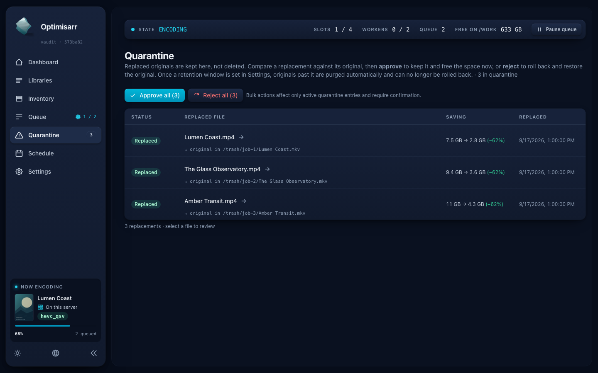
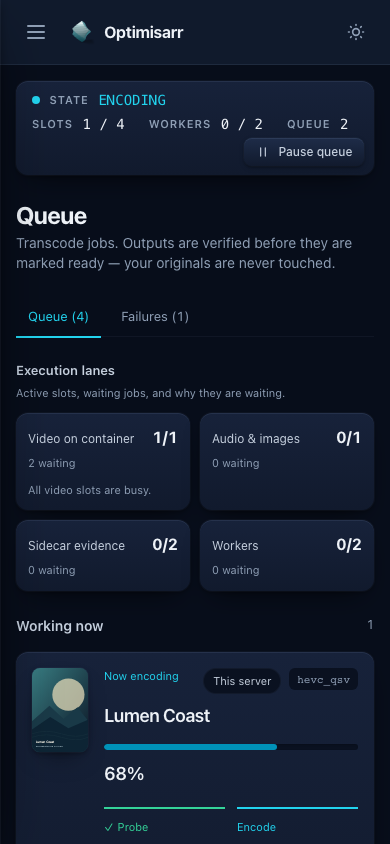
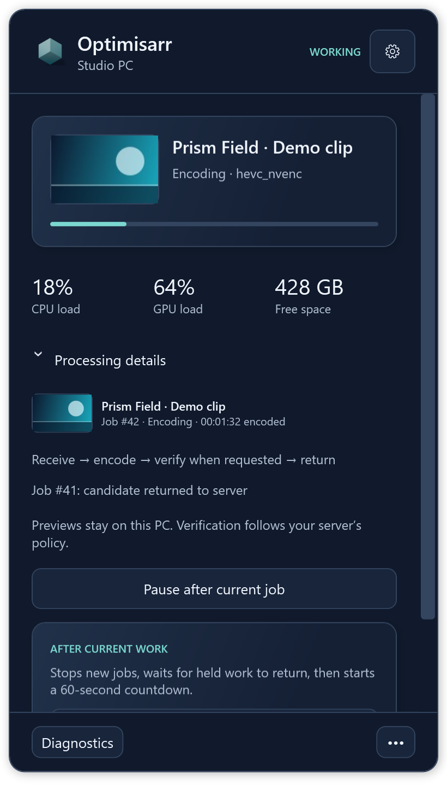

# Application review: tested mitigations

This follow-up implements the eight findings from the
[30 September application review](2026-09-30-full-application-review.md).
The original report remains a historical record of commit
`573ba821587db92b1958429b5045a376189fbe19`; its defect probes deliberately assert
the old failures. Permanent regression tests now assert the safe behavior.
The [review prompt](../development/application-review-prompt.md) remains reusable.

## Changes and regression evidence

| Finding | Implemented mitigation | Permanent regression coverage |
|---|---|---|
| R1: verification could apply to different bytes at replacement | Record exact verified source/candidate SHA-256 identities, check before moves and at the final paths, and freeze identities in the pending rollback record. Recovery never finalizes from size alone. | Same-size candidate mutation; upgraded source; historical ready output without hashes; a new file appearing after quarantine; ambiguous same-container remnant; changed quarantine identity; cancellation after the first move; existing crash recovery and rollback tests. |
| R2: a result upload could revive a cancelled or expired assignment | Re-read current credentials, lease, attempt and source identity in a short writer transaction after transfer/hash. Candidates belong to a lease; promotion cannot overwrite another candidate. Serialize chunks, completion and offset reads per lease. | Cancellation, elapsed expiry, explicit expiry, credential revocation and attempt changes during a controlled stream; renewal during delivery succeeds; simultaneous chunks at the same offset append only once; existing resumable/hash/strict-verification tests. |
| R3: discovery could deadlock on stderr and leave a cancelled child | Drain both pipes concurrently; bound retained output to 1 MiB of characters per pipe while continuing to drain; enforce a 30-second probe deadline; kill and reap the owned process on abort. Oversized/incomplete listings are unavailable, not trusted capabilities. | Generated executable writes 1 MB to stderr while producing valid stdout; a sleeping owned child is cancelled and verified exited; explicit deadline and excess-output probes fail closed. The Windows version uses PowerShell 7 under its normal policy, without an execution-policy bypass; valid stdout must still be reported as an available tool after the stderr flood. |
| R4: malformed stored reports could break diagnostic exports | Validate report structure before summarizing it. Invalid reports are omitted with an explicit manifest reason; failure summaries use the same guard. | Null check collections, null entries, missing/empty checks, unknown outcomes, malformed JSON and missing check names; valid named/numeric outcomes in current and historical reports; existing redaction tests. |
| R5: sidebar progress had no accessible name | Name expanded and collapsed progress indicators with their existing translated heading, title and worker location. Indeterminate progress gets a state description. | Axe checks across every audited route, plus existing job/sidebar interaction coverage. |
| R6: status text and Quarantine guidance lacked contrast | Use the theme's strong status tokens and readable secondary text for meaningful Quarantine copy. Card texture, layout, hover lift and shadows remain unchanged. | Automated WCAG contrast checks in desktop dark and phone light on Chromium and WebKit; geometric, hover and keyboard-focus checks; representative screenshot review. |
| R7: paged feeds loaded full report histories first | Apply count, exact UTC date filtering, stable ordering and paging in SQL before DTO/report hydration. Select the latest 500 diagnostic leases in SQL. Add indexed computed UTC tick columns without rewriting stored timestamps. | SQL capture requires LIMIT/OFFSET on report hydration; offset and sub-millisecond date boundaries; total/page behavior; populated historical schema upgrade and repeat migration; independent 100,000-row SQLite planner exercise. |
| R8: architecture described unsafe replacement order | Document durable pending intent before quarantine, candidate placement and final identity checks. Include Linux alongside Mac and Windows sidecars. | Documentation link/API validation and comparison with implementation and recovery tests. |

The initial nine reproductions failed against the baseline before implementation.
Additional red/green cycles covered pagination and accessibility, then the
second-order recovery, retention, chunk concurrency, retry and cancellation
cases. Raw logs stay private; source tests and the historical reproduction patch
are the reviewable evidence. Compilation mistakes in new fixtures and test-run
artifact collisions are not counted as product defects.

## Second-order review

### Replacement, recovery and cleanup

Changing recovery to preserve unidentified files creates a legitimate pending
state. A failed job can now still own the only recorded path to its quarantined
original. Queue clearing, individual removal, manual retry and pending-queue
clearing therefore refuse live or interrupted rollback owners. Retention excludes
their work outputs and rechecks protection immediately before removal. Clearing
terminal history reserves the writer in batches so a replacement record cannot
appear between the protection check and deleting its parent.

Recovery only removes a destination file when it matches the verified candidate.
If quarantine has a recorded identity and no longer matches it, recovery preserves
both paths and the pending record. A partial remnant or unrelated new source is
not guessed away. Cancellation after quarantine completes restoration and saves
its cleanup without using the already-cancelled request token.

Old ready outputs have no proof of the bytes that earned their historical pass.
They fail closed, record a failed **File identity** gate and become eligible for
the normal Retry action. This also covers manual replacement; leaving the row
Ready would otherwise strand the user without a retry action. A conditional
update protects concurrent cancellation and newer attempts. Positive regression
checks also exposed named enum outcomes being omitted by a numeric-only parser:
both persisted formats now retain their quality measurements in reports and exports. Legacy pending records may
restore a quarantined original into an empty path, but an unidentified occupied
path remains protected. No migration fabricates a hash from file size or an old
pass flag.

### Retries and worker delivery

A fresh encoding attempt clears previous identities. A software-decoder retry
within the same attempt retains the source identity and discards the old verdict;
a regression test caught and corrected a reset that would otherwise block the
second encode.

Per-lease upload locks are process-local and are removed after the last holder or
waiter. Transfers for different leases remain independent. This matches the
single application-instance/SQLite deployment model; it does not establish a
multi-server upload protocol. The lease-specific filename keeps the existing
remote-candidate prefix and final container extension, so restart recovery and
worker contracts remain compatible.

Streaming, candidate hashing and hashing an existing crash remnant happen before
the write transaction. Cancellation, revocation and renewal serialize with the
fresh acceptance check. SQLite permits only one writer, which is why multi-GB
hashing must not hold that reservation. See the official
[SQLite transaction guidance](https://learn.microsoft.com/en-us/dotnet/standard/data/sqlite/transactions).

Strict sidecar verification still performs media health and quality work on the
worker. The server owns transfers, hashes, evidence validation, replacement,
quarantine and database transitions. Stronger identity checks add full-file I/O;
they do not remove all server work. Ordinary file sharing guards and repeated
path hashes improve safety but cannot prevent arbitrary non-cooperating external
filesystem writers from changing media after a completed operation.

### Queries and UI

The migrations preserve offset-bearing timestamp text. Generated UTC ticks retain
100-nanosecond precision and make ordering/filtering indexable; page ties use the
job ID. Reapplying migrations is a no-op. Building the new indexes on a large
existing history can consume startup time and temporary storage.

An owned SQLite database with 100,000 jobs and 4,201-character reports used the
new order index for page 1 and page 1,000, returning only 50 reports each. The date
count used the effective-time index. On the test Mac, those queries took about
0.3 ms, 1.4 ms and 2.4 ms respectively. This was a warm local SQL/planner exercise,
not an API concurrency benchmark or latency promise. The database was removed
after its redacted summary was saved. Explicit unpaged API queries remain
unpaged for compatibility.

Strong theme status colours also affect existing components sharing those tokens.
The full UI audit covers both themes, mobile widths, large text and translated
controls; human review checked representative layouts. Automated accessibility
checks supplement keyboard and assistive-technology testing; they do not establish
complete WCAG conformance.

## Executed validation

| Surface | Result and scope |
|---|---|
| Local Mac backend | 2,506 tests pass; Release build has zero warnings/errors. |
| Quark Linux backend | 2,506 tests pass; Release build has zero warnings/errors, from an isolated copy of the final application/test sources. |
| Shared sidecar core on Quark | 258 tests pass. This is portable worker logic, not Windows native UI certification. |
| Linux sidecar on Quark | 29 tests pass. |
| Mac sidecar | Swift suite reports 237 test declarations in 49 suites; opt-in live suites are separately gated. Release AcceptanceWorker builds. |
| Mac RAM work directory | Real RAM volume creation, crash sweep and production-runner success/failure/cancellation tested with bundled FFmpeg. |
| Browser UI | All 195 Chromium E2E tests and 12 WebKit audit tests pass. Axe scans 30 routes per appearance in desktop dark and phone light; frontend check has zero Svelte errors/warnings and 75 unit tests pass. |
| Python harness and maintenance | 64 tests pass. Release metadata, documentation links, OpenAPI drift and migration-model checks pass. |
| Mac media acceptance | 40 selected fleet cases pass using libx265 locally and the production Mac worker with HEVC VideoToolbox. Includes SDR, VFR, timestamp offset, 10-bit, subtitles, adaptive quality, deliberate VMAF rejection, audio/image work, independent corruption oracles, cancellation, reconnect, isolation and rollback. |
| Running Riker container and Quark sidecar | Finite generated-media probes completed encode, 48-frame count, full decode and VMAF with exit 0 on both. VMAF mean 97.973, minimum 96.021. These test installed toolchains, not deployment of this branch. |
| PICARD native Windows | Zero-warning backend/sidecar Release builds; 258 sidecar tests pass. All 51 process/replacement/migration regressions pass, along with native popover anchoring, monitor rendering and tray-motion rendering. The full backend run passes 2,488 tests with the same 18 Windows-specific baseline failures described below. |

Media acceptance used the replacement/delivery hardening revision (`5dd84d5`).
The subsequent manual identity-refusal workflow change was retested by both full
backend suites and the Windows CI regression gate; it does not alter encoding or
quality scoring.

Production queue, media, pairing and container lifecycle were not changed by this
review work. Generated fixtures, isolated servers/workers and owned scratch files
were used for testing. CI validates a fresh container build and smoke/media
acceptance before merge; installed-container probes do not substitute for that.

GPU, driver, HDR format and
filesystem combinations outside the selected matrix are not certified. Pending
path conflicts require inspection rather than automatic deletion of unknown files.
See [safe replacement](../operations/safe-replacement.md) for operator guidance.

## Native Windows follow-up

PICARD became available before merge. Its RTX 4070 (12 GB, driver 617.14) proved
H.264, HEVC and AV1 NVENC through the production capability prober. Disposable
workers run the branch's Windows sidecar core, use generated media and hold only
test credentials in memory. SSH reverse forwards reach the isolated loopback
server; the installed worker's credentials, settings and service remain intact.

The first native run exposed three new test-fixture failures: the tests invoked
Windows PowerShell, whose default policy on this host disallows script files.
They now invoke the installed PowerShell 7 test host with its normal policy.
No security or execution policy was changed. A stronger assertion also requires
the stderr-flood probe to report available, valid stdout; merely returning without
an exception is insufficient.

All 18 remaining full-backend failures also reproduce against the exact reviewed
`dev` baseline, which passed 2,433 of its 2,451 tests on Windows. They comprise
Unix hard-link fixtures (four probe and three inventory cases), POSIX path
expectations (four replacement-planner, two library-refresh, and one each for
work paths, setup mounts and readiness), a synthetic-media fixture using POSIX relative paths, and the
queue-pause test expecting process suspension on a host that supports dispatch
pause instead. They are recorded as outstanding backend-suite portability work,
not hidden by skipping or changing those tests. The supported Mac/Linux backend
suites remain fully green. Native Windows sidecar and the new safety regressions
are independently green.

### Hardware finding: explicit H.264 NVENC range

The first focused MP4 run passed HEVC and AV1 but failed the independent colour
check for H.264 NVENC: its source declared `color_range=tv`, while the candidate
left the range unspecified. Pictures, fractional cadence and VMAF still passed.
The existing production gate permits an unspecified output tag, so this was a
metadata-preservation discrepancy rather than evidence of pixel corruption.

An isolated native experiment proved that `-color_range tv` alone still omitted
the H.264 tag; the documented
[FFmpeg H.264 metadata bitstream filter](https://ffmpeg.org/ffmpeg-bitstream-filters.html#h264_005fmetadata)
preserved it. The dispatcher now carries only the fresh probe's declared range
into the transcode specification. H.264 NVENC commands set the matching output
range and `h264_metadata` flag on video stream zero. Unknown range is never guessed
or interpolated into a filter. A deliberate HDR-to-SDR transform selects limited
range; copied video and other encoders receive no workaround. Neither production quality gates
nor independent acceptance assertions were relaxed.

Four new behaviour tests failed before implementation; all twelve range/guard
cases now pass. A native full-range source/candidate experiment also checks that
preserving limited range does not incorrectly retag full-range pictures. Both
probes retained `pc` and all 96 decoded frames; independent VMAF was 99.972.

The new options are an explicit protocol-5 extension. Mac and shared Windows/Linux
command guards accept only `tv`/`pc` and the two fixed H.264 range-filter values;
other bitstream operations, filter chains and stream selectors remain refused.
The server checks the required protocol before issuing a lease, explains the
upgrade requirement to older workers, and still allows ordinary older-protocol
work. Tests also pass the actual server-built commands through the shared guard,
so a future builder/validator mismatch cannot be hidden by hand-written fixtures.

Native Windows additionally exposed a two-second unit-fixture deadline under
filesystem load. Its deadline now guards a hang without imposing a latency SLA;
assertions still require exactly one offset request, lease release and empty
scratch after a terminal delivery refusal. Production retry behavior is unchanged.

### Completed physical-GPU matrices

| Matrix | Passed checks | Scope |
|---|---:|---|
| Initial three-codec fleet | 69 | HEVC/H.264/AV1 NVENC: SDR, variable cadence, timestamp offsets, 10-bit and fractional timing; GPU decode, adaptive quality, deliberate VMAF rejection, audio, cancellation/reconnect, independent corruption oracles and rollback. |
| Corrected H.264 fleet | 43 | Repeat the full H.264 matrix after the metadata and protocol-5 guard fixes. |
| Fractional MP4 timing | 16 | All three NVENC codecs; independent range, frame-count, cadence, audio and VMAF checks. |
| Overlapping subtitles | 19 | All three codecs, with Matroska fallback and compatible filtered MP4 output. |
| Copied ALAC | 27 | All three codecs: Matroska, native MP4, filtered tracks and remux/no-op paths. |

Every completed matrix has zero failed or blocked checks and uses strict worker
verification. Counts include fixture/setup/cleanup checks and overlap across
matrices; they are not counts of unique media files. The final four matrices
executed the corrected protocol-5 sources at `da731fe6aa854aece9de053ebbb01e1fb8321d65`.
The initial fleet preceded the new range options. Interrupted intermediate runs
that exposed the command-guard mismatch are not counted as passing evidence.

The [redacted native evidence](2026-10-01-picard-evidence.json) records case names,
results and the unchanged baseline failures without private endpoints, credentials
or media paths. Final inspection found no remaining owned acceptance worker
processes and no files in any owned worker scratch directory. Installed workers
and other agents' processes were not altered. Older sidecars need the protocol-5
update to receive range-preserving H.264 assignments; no production rollout is
included in this review merge.
