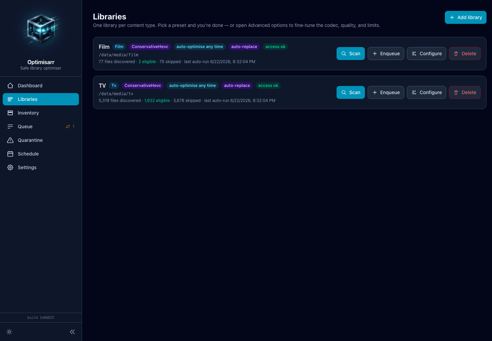

# Getting started

Optimisarr runs as one container. It persists SQLite state in `/config`, reads
libraries in `/data`, writes temporary results to `/work`, and quarantines
originals in `/trash`.

## Deploy

Pick the Compose file that matches the host:

- [`compose.cpu.example.yml`](../../compose.cpu.example.yml) for CPU-only systems.
- [`compose.nvidia.example.yml`](../../compose.nvidia.example.yml) for NVIDIA NVENC.
- [`compose.intel-qsv.example.yml`](../../compose.intel-qsv.example.yml) for Intel QSV.
- [`compose.vaapi.example.yml`](../../compose.vaapi.example.yml) for Intel/AMD VA-API.
- [`compose.example.yml`](../../compose.example.yml) as a commented reference file.

Copy one to `compose.yml`, edit the host paths, then create the mounted folders
with ownership matching the `PUID`/`PGID` you configured:

```bash
mkdir -p ./config /path/to/work /path/to/trash
sudo chown -R 1000:1000 ./config /path/to/work /path/to/trash
```

Start the container and wait for readiness:

```bash
docker compose up -d
curl http://localhost:8787/api/health
curl http://localhost:8787/api/ready
```

The first command confirms the web process is alive. The readiness endpoint
additionally confirms that the database, FFmpeg/ffprobe, and required writable
paths are available; wait for it to succeed before using the queue.

Keep `/data`, `/work`, and `/trash` on one filesystem when possible so
replacement can use atomic moves. Ensure `PUID` and `PGID` can write all four
mounts.

Do not publish `8787` directly to the internet. For remote access, put Optimisarr
behind an authenticated reverse proxy; see [reverse proxy](reverse-proxy.md).



## First workflow

1. Enable **Dry-run mode** in **Settings → Replacement**.
2. Add a library below `/data` and select its media type and rule profile.
3. Scan it; newly found files are probed in the background.
4. Review the explicit eligibility reason in **Inventory**.
5. Queue a small test set and inspect its verification report.
6. Disable dry-run only after the reports look right, then replace outputs you
   have reviewed. Originals remain in **Quarantine**
   until approved or retention purges them.

After that manual test, optional **Auto-optimise** and **Auto-replace** settings
can automate the same workflow per library. See [configuration and scheduling](configuration.md)
before enabling either one.
