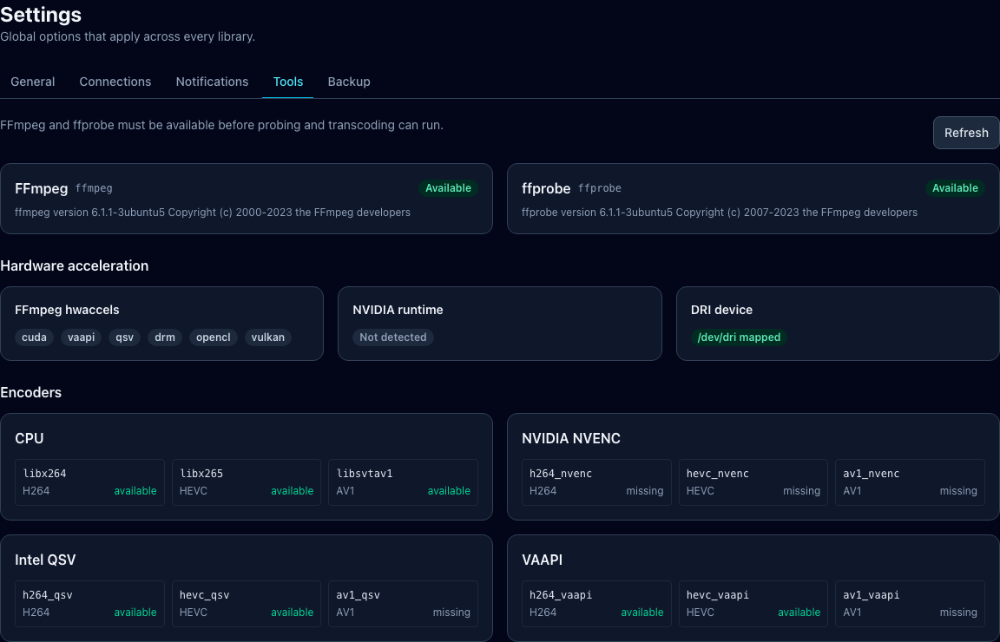

# Hardware acceleration

See the maintained [hardware validation matrix](hardware-validation-matrix.md) for the distinction
between automated implementation coverage and paths proven on a physical GPU.

Use **Settings → Tools** after deployment. Optimisarr verifies each available
encoder with a real test encode; a GPU device node alone is not sufficient.

Screenshots in this page use fabricated dummy media created for documentation.
No copyrighted material is used.



The bundled Jellyfin FFmpeg is used for both hardware detection and transcoding, so the
Tools page is the source of truth for what this container can actually encode. A separate
static FFmpeg supplies the optional `libvmaf` quality-measurement filter and appears as its
own Tools entry. A configured `OPTIMISARR_FFMPEG_VMAF_CUDA` binary appears separately and is usable
only when it exposes `libvmaf_cuda`; actual GPU/driver/source compatibility is checked by the first
measurement. Runtime failures fall back to software, and a measured hardware-decoded score below
the selected quality floor is confirmed in software before the output is rejected. The Queue shows
the selected encoder on each job.

## Encoder effort

The per-library **Encoder effort** setting describes intent rather than storing a raw FFmpeg
preset. Optimisarr resolves it after the exact encoder has been selected:

| Effort | x264/x265 | SVT-AV1 | NVIDIA NVENC | Intel QSV | VAAPI |
|---|---|---:|---|---|---|
| Fast | `fast` | `10` | `p2` | `fast` | Driver default |
| Balanced | `medium` | `8` | `p4` | `medium` | Driver default |
| Efficient | `slow` | `6` | `p7` | `slow` | Driver default |

This is particularly important in **Auto** mode, where the encoder depends on the target codec,
proved host capabilities, and source bit depth. Existing libraries, API requests, and imported
backups may retain a former x264/x265 value, NVENC `p1`–`p7`, or SVT-AV1 `0`–`13` preset. That exact
value remains in force on its native encoder and stays visibly labelled as legacy until the operator
chooses a portable effort; another encoder family receives its closest safe equivalent. Any
unrecognised value is rejected before a job can reach FFmpeg.

## Intel and AMD

Map `/dev/dri` and set `RENDER_GID` to the host render-node group:

```bash
stat -c '%g' /dev/dri/renderD128
```

Use [Intel QSV](../../compose.intel-qsv.example.yml) or
[Intel/AMD VA-API](../../compose.vaapi.example.yml). Both map `/dev/dri` and
use `RENDER_GID` for render-node access; select **Intel QSV** or **VA-API** in
Settings after Tools has validated the encoder.

## NVIDIA

Install NVIDIA Container Toolkit and configure `NVIDIA_VISIBLE_DEVICES=all` and
`NVIDIA_DRIVER_CAPABILITIES=compute,video,utility`. The `video` capability is
required for NVENC. Use the [NVIDIA Compose example](../../compose.nvidia.example.yml)
and select a hardware mode only after Tools reports success.

For systems with no GPU, use the [CPU-only Compose example](../../compose.cpu.example.yml).

Hardware decode is used with hardware encoders when possible and retries with
software decode when a source cannot be decoded on the GPU. Eligible SDR VMAF passes use the same
selection: Intel QSV and VA-API can decode both inputs before downloading frames for CPU scoring.
That GPU-to-RAM copy means hardware decode is not guaranteed to be faster; benchmark it on the host.
There is no Intel/AMD/NPU backend for VMAF's feature extractors.

**Auto** also keeps the always-on video bit-depth gate honest. The supported NVENC, Intel QSV, and
VA-API H.264 paths cannot preserve a 10-bit source, so an H.264 target uses the bundled 10-bit
`libx264` encoder for that file instead of silently converting it to 8-bit. An explicitly selected
hardware mode fails before encoding and asks you to use Auto/CPU or choose HEVC/AV1. Sources above
10-bit fail closed because no supported H.264 encoder can preserve them. The preserved H.264 High 10
output is less widely playable, can be slower, and can be larger than the source; it is therefore not
the broad 8-bit compatibility promise normally associated with the preset. See
[Known issues](../../KNOWN_ISSUES.md#compatibility-h264-is-not-broadly-compatible-for-sources-above-8-bit).

NVIDIA is the only full scoring-acceleration path. Supply an FFmpeg build with `libvmaf_cuda`,
FFmpeg NVIDIA codec support, and `scale_cuda` through `OPTIMISARR_FFMPEG_VMAF_CUDA`; Optimisarr then
uses NVDEC and keeps both SDR streams in CUDA memory. HDR remains on the software path so its 10-bit
and tone-map preparation is unchanged. See FFmpeg's official
[`libvmaf_cuda` example](https://ffmpeg.org/ffmpeg-filters.html#libvmaf_005fcuda) and
[hardware-acceleration caveats](https://ffmpeg.org/ffmpeg.html#Advanced-Video-options).

GPU usage graphs require an unprivileged metrics source. Intel/AMD are read from
DRM fdinfo and NVIDIA from `nvidia-smi`; if neither is available, encoding can
still work while the UI reports GPU stats unavailable.
