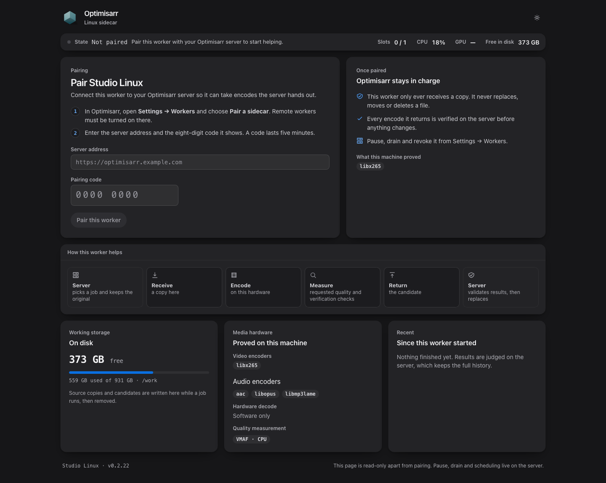
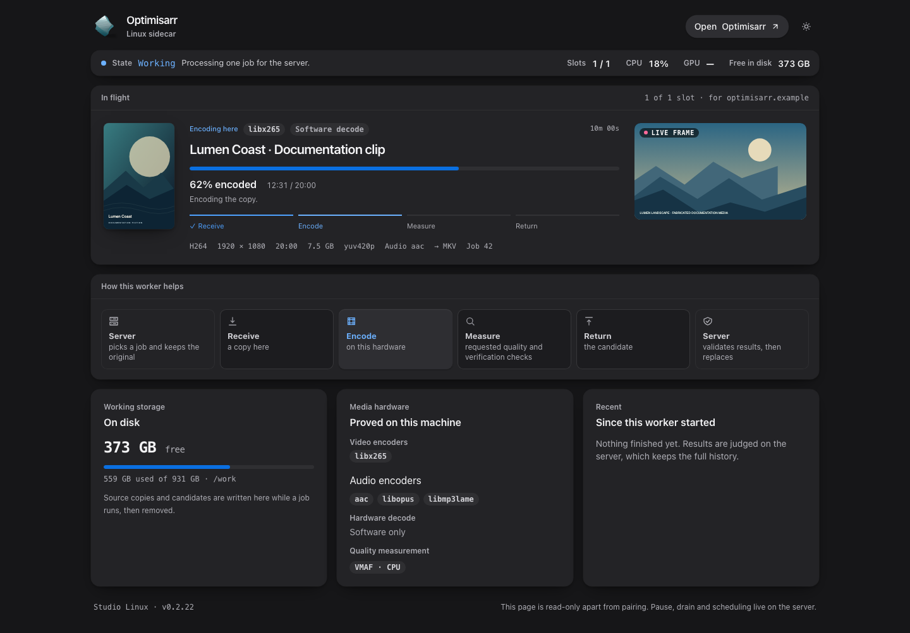

# Linux container sidecar (preview)

Run video encoding and requested verification on a separate Linux host. The worker downloads
job copies to its own scratch space; it needs no media-library mount. The main Optimisarr server
keeps scheduling, transfers, policy checks, replacement, quarantine and rollback. Originals are
replaced only after the configured verification gates pass.

Screenshots use fabricated dummy media created for documentation. No copyrighted material is used.

## Start and pair

You need Docker with Compose on a Linux x86-64 host, a reachable Optimisarr server, and enough
working storage for source and candidate files. The published sidecar build currently targets
`linux/amd64`; ARM64 publication and native/systemd installation are not provided by this workflow.

1. On the **main server**, ensure **Remote workers** is enabled. Remove any
   `OPTIMISARR_EXPERIMENTAL_REMOTE_WORKERS=false` override and redeploy through
   your normal stack manager, then enable **Remote workers** in **Settings → Files & safety**.
2. Copy [compose.sidecar.example.yml](../../compose.sidecar.example.yml) into a separate worker
   stack and deploy it. Its default is CPU encoding with disk scratch. On managed hosts, commit
   and deploy through the stack manager. The worker image is
   `ghcr.io/jellman86/optimisarr-sidecar:dev`, separate from the main server image.
3. Open `http://<worker-host>:8788` on your private network. On the main server, open
   **Settings → Remote workers → Pair a sidecar**. Enter that server's HTTP(S) address and the
   eight-digit code in the worker page. Codes expire after five minutes and work once.
4. Confirm the page shows a connection and proved encoders. Follow
   [worker placement and verification](remote-workers.md#placement) to choose which libraries
   may use it. Start with a small test job and inspect its verification report.



The example's core configuration is:

```yaml
services:
  optimisarr-sidecar:
    image: ghcr.io/jellman86/optimisarr-sidecar:dev
    restart: unless-stopped
    stop_grace_period: 45s
    environment:
      OPTIMISARR_WORKER_NAME: Linux worker
      OPTIMISARR_CONCURRENCY: "1"
      PUID: "1000"
      PGID: "1000"
    ports:
      - "8788:8788"
    volumes:
      - sidecar-config:/config
      - sidecar-work:/work
volumes:
  sidecar-config:
  sidecar-work:
```

`/config/pairing.json` contains the private worker credential. Keep `/config` persistent and
protect its backups. Each worker needs its own config and scratch directories; do not scale
replicas against the same volumes. Pairing survives container replacement. After server-side
revocation, the running worker returns to its pairing form. To use another server, revoke the
old identity and give the worker a new config volume.

The image workflow publishes `:dev` from `dev`, `:main` and `:latest` from `main`, and full
version tags from release tags. Use `:dev` for the current preview; older release images may
predate these features. Pin an available version or digest for controlled upgrades. Pull requests
build and test images without publishing them.

## Intel acceleration

On an Intel host with the graphics driver loaded and `/dev/dri/renderD128` present, add this
under the worker service (or uncomment it in the supplied example):

```yaml
    devices:
      - /dev/dri:/dev/dri
```

The image includes Jellyfin FFmpeg, the Intel iHD driver and oneVPL runtime. Its entrypoint adds
the worker user to the mapped device groups before dropping privileges. Only encoders and
decoders that pass real probes are advertised. Optionally set `OPTIMISARR_ENCODER: hevc_qsv`
or `hevc_vaapi` to restrict the advertised encoder; a failed probe then prevents that worker
from becoming ready. Leave the setting unset to advertise all successful probes.

The current command path targets `/dev/dri/renderD128`; there is no sidecar setting to select
another render node. GPU-surface decoding is proved for H.264 8-bit 4:2:0. Other input formats
and workflows needing software filters can retain software decoding. CPU VMAF uses a separate
bundled measurement binary even when encoding uses the GPU. Mapping `/dev/dri` does not expose
an NVIDIA GPU; NVIDIA needs the host's container runtime and GPU configuration. See the
[hardware evidence and limits](../engineering/hardware-validation/2026-09-27-linux-sidecar.md)
before assuming a GPU or format is covered. A separate
[Linux-container HEVC NVENC acceptance record](../engineering/hardware-validation/2026-09-30-linux-nvenc.md)
records the published image on an RTX 4070; it does not certify every NVIDIA codec or driver.

## Optional RAM working storage

To keep working files in RAM, remove `sidecar-work:/work` from the service's `volumes`, leaving
`sidecar-config:/config`, and add this under the service:

```yaml
    tmpfs:
      - /work:size=8g,mode=0700,uid=1000,gid=1000
```

Remove the now-unused top-level `sidecar-work:` volume too. Match `uid` and `gid` to your
`PUID` and `PGID`. The 8 GiB limit is an example capacity, not a recommended size for all media.
Leave RAM for the host, FFmpeg, verification and every concurrent source/candidate pair.

The worker requires at least twice the source size free before downloading. This check is
not a shared RAM reservation or a guarantee that a job will fit: concurrency, candidates and
other scratch files also consume space. Unknown source size or insufficient space refuses the
job; exhaustion during processing fails it while leaving the server's original intact. Linux
tmpfs can use swap. There is no automatic disk fallback or worker-managed RAM disk. GPU frame
memory is separate from RAM working-file storage.

## Watch work and load



The worker page shows connection state, source codec/resolution/duration/audio, poster and small
live preview frames, encoding progress/speed/time left, current stages and recent results. It
also shows proved encoders/decoders, VMAF capabilities, filesystem type and remaining scratch
space. Older servers may omit the extra media facts. Frames are generated only while a viewer
polls and are discarded when the job ends.

CPU is host-wide. Intel/AMD DRM GPU readings cover the worker's child processes; AMD/NVIDIA
may use device-wide counters as a fallback. Missing telemetry stays blank and short jobs may
finish before a useful GPU sample. Pause, drain, resume, revoke, scheduling and library settings
remain on the main server. The page also reports when the server offers a newer sidecar release.

See the [sidecar screenshot gallery](../usage/screenshots.md#linux-container) for light,
phone, idle and audio views.

## Settings

Set these in the worker service's `environment`; server settings belong on the main server.
Changes take effect when the worker container is recreated.

| Variable | Default / meaning |
| --- | --- |
| `OPTIMISARR_SERVER` | Optional HTTP(S) server URL without embedded credentials. Locks browser pairing to that server; must match saved pairing. |
| `OPTIMISARR_PAIRING_CODE` | Optional one-time code for pairing without the page; requires `OPTIMISARR_SERVER`. Tried once per process when unpaired. |
| `OPTIMISARR_PAIRING_CODE_FILE` | Mounted secret file containing the code; takes precedence over the code environment variable. Must be readable by the worker user. |
| `OPTIMISARR_WORKER_NAME` | Container hostname; the Compose example uses `Linux worker`. |
| `OPTIMISARR_CONCURRENCY` | `1`; accepts 1–4 concurrent jobs. Budget CPU, GPU and scratch for all slots. |
| `OPTIMISARR_CONFIG_DIR` | `/config`; private persistent pairing and transient health state. |
| `OPTIMISARR_SIDECAR_WORK` | `/work`; disposable job storage. |
| `OPTIMISARR_ENCODER` | Unset; optional restriction to one successfully probed FFmpeg encoder name. |
| `OPTIMISARR_WEB_ENABLED` | `true` in the image. Only the literal `true` enables the page; native runs default to disabled. |
| `ASPNETCORE_URLS` | `http://0.0.0.0:8788` in the image; dashboard listener. Update the port mapping if changed. |
| `PUID`, `PGID` | `1000`; the entrypoint starts as root, prepares directories/device groups, then drops privileges. |
| `UMASK` | `077`. |
| `OPTIMISARR_FFMPEG` | `/usr/lib/jellyfin-ffmpeg/ffmpeg`; matching `ffprobe` must be beside it. |
| `OPTIMISARR_FFMPEG_VMAF` | `/usr/local/lib/optimisarr/ffmpeg-vmaf`; separate measurement binary. |

Prefer browser pairing or a mounted secret over keeping a pairing code in stack configuration.
After pairing, remove the one-time code. If disabling the page, complete pairing first or supply
the server and code/secret at first start. Keep the bundled media tools unless testing a custom build.

## Connectivity and reverse proxies

All worker traffic to the main server is outbound HTTP(S); the server never calls the worker's
port 8788. That published port is for people viewing and pairing the worker. You can omit it for
a headless installation. The server URL must resolve and be reachable **from inside the worker
container**: `localhost` points at the worker itself. Use a private reachable address or a
properly trusted HTTPS hostname. Serve both apps at the root of their own hostname.

The worker dashboard has no login. Anyone who can reach it can see titles, frames and machine
information, and an unpaired worker accepts pairing there. Keep it on a trusted network or
behind an authenticated reverse proxy. `OPTIMISARR_ADMIN_TOKEN` does not add authentication to
this page. The page polls HTTP endpoints; it does not need the main app's SignalR WebSocket.

A proxy in front of the **main server** must allow worker API traffic without interactive login:
`/api/workers/pair`, `/api/workers/heartbeat`, `/api/workers/claim` and
`/api/workers/leases/...`. Pairing uses its one-time code; subsequent calls carry the worker's
own bearer credential. Preserve `Authorization`, range requests and resumable upload headers,
allow PATCH uploads of at least 8 MiB, and allow long media transfers. Keep the other worker
administration endpoints protected; do not bypass authentication for all `/api/workers` routes.
The client has no proxy-login or service-token setting. See [reverse proxy setup](reverse-proxy.md)
for the main server's UI and TLS guidance.

## Health, upgrades and troubleshooting

`GET http://<worker-host>:8788/api/health` returns `{"status":"ok"}` when the web host is alive.
The Docker healthcheck instead requires recent successful server contact (less than 100 seconds
old). An unpaired or disconnected worker can have a working page and still be unhealthy.
The image checks every 30 seconds with a 180-second startup period and three retries. Allow
pairing to finish before treating initial unhealthy status as a crash.

Before upgrading, **Drain** the worker on the server and wait for held jobs to finish. Update
the sidecar image through your stack manager, preserve `/config`, keep a stop grace period of at
least 45 seconds, then resume it on the server and check its connection/capabilities. SIGTERM
cancels active work and lets the session release leases and clean scratch. The worker does not
shut down or sleep its host, and does not update itself.

| Symptom | Check |
| --- | --- |
| Pairing fails | Server feature flag and Remote workers toggle, a fresh code, container DNS/TLS/connectivity, and proxy authentication. A set `OPTIMISARR_SERVER` overrides the URL entered on the page. |
| Configured server differs from saved pairing | Restore the original URL, or revoke the old identity and use a new config volume for the new server. |
| Permission or directory-in-use error | Writable config/scratch for `PUID`/`PGID`, readable pairing secret, and unique directories for each worker. Changing UID does not recursively fix existing files. |
| GPU encoder absent | Host driver, mapped `/dev/dri/renderD128`, device permissions and the real probe result in container logs. Remove an encoder restriction that the host cannot satisfy. |
| Worker stays idle | Server drain/pause state, library placement and schedule, matching encoder/verification capabilities, and scratch capacity. See [idle worker checks](remote-workers.md#if-a-worker-stays-idle). |
| Transfer stalls or fails | Proxy upload/body limits, PATCH/Range/header handling, timeouts, network interruptions and scratch space. |
| RAM scratch runs out | Drain, wait for work to finish, then increase the bounded mount, lower concurrency or switch `/work` to disk. |

Use the worker page, the main server's worker card and the stack manager's container logs for
diagnosis. For development builds and isolated media acceptance, see the
[Linux source README](../../sidecars/linux/README.md). This is a preview: short SDR CPU/Intel
acceptance does not establish every HDR format, GPU, long job or concurrency combination.
