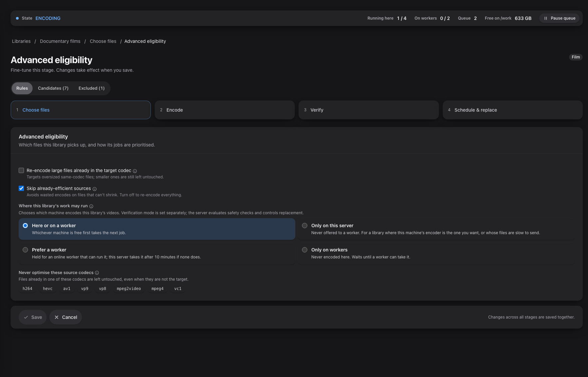
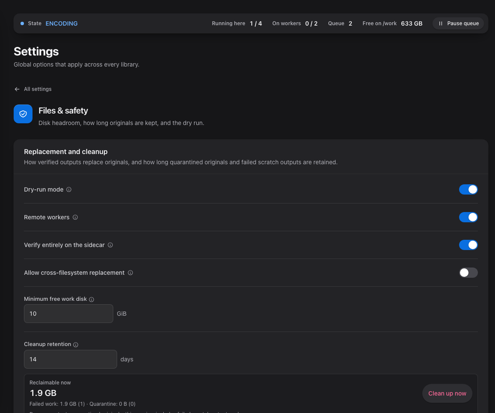

# Remote workers and sidecars

Optimisarr can send video re-encodes to a paired Windows PC, Apple Silicon Mac or Linux container.
The main server keeps the library, job history, and authority to replace or roll back files. Workers use their own
scratch space and return candidates and measurements; they cannot modify your originals.

Remote workers remain an opt-in preview. A single container is still the default installation.

Screenshots use fabricated dummy media created for documentation. No copyrighted material is used.

## Enable and pair

1. Set `OPTIMISARR_EXPERIMENTAL_REMOTE_WORKERS=true` in the container environment and deploy it.
2. Open **Settings → Files & safety** and enable **Remote workers**, then save.
3. Open **Settings → Remote workers** and issue a pairing code.
4. Install the sidecar and enter the server URL and code. The code expires after five minutes,
   can be used once, and is invalidated after five wrong guesses.
5. Confirm the machine is online and has proved the encoder needed by your library. Advertised
   hardware is checked with real test encodes; the presence of a GPU alone does not qualify it.

For Linux, use the [container setup guide](linux-sidecar.md): deploy its separate Compose stack,
pair on port 8788, and monitor media, load and scratch space in the worker page. Worker controls
remain on the main server.

Use the [Mac installation guide](../../sidecars/macos/README.md) or the
[Windows MSI guide](../../sidecars/windows/installer/README.md) for platform requirements,
installation, upgrades, and packaging/signing status. Windows installs a background service and
tray companion. The Mac runs from the menu bar. Both expose a compact current-work monitor,
processing details, pause, preferences, and diagnostics.

Windows MSI upgrades restart a paired worker using its retained pairing; fresh installs and
unpaired upgrades wait for pairing. Drain before upgrading and resume from the server afterward.
An upgrade starts a paired service even if it was stopped before the update.

Closing either monitor keeps work running. Quitting the Windows tray leaves its service running;
quitting the Mac app returns its held jobs. **Pause new jobs** lets held jobs finish and resets
when the worker/app restarts. A server-requested **Drain** also stops new claims while existing
leases finish; use it before an update and resume the worker afterward.

## Keep worker command support current

Update sidecars alongside the server. H.264 NVIDIA jobs that preserve a declared
colour range require worker protocol 5; an older sidecar stays available for
ordinary work and reports that an update is needed for those jobs. Timed-text
subtitle conversion to Matroska requires protocol 4. Unsupported commands are
held before a lease is issued, rather than sent to the worker to fail.

## Choose where a library runs

### RAM storage and GPU processing

These are separate capabilities. The Mac sidecar's **Preferences → Where work happens → Memory**
stores the job's working source and candidate on a temporary RAM disk when they fit its budget.
The budget is shared across jobs and includes the candidate-size limit and filesystem overhead.
Jobs without a bounded candidate, adaptive searches, and jobs that cannot reserve or create a RAM
disk use the normal disk folder. The monitor reports the actual storage and fallback reason.
Source downloads stream directly to working storage without a temporary download file.

The Windows sidecar currently uses a disk folder (`C:\OptimisarrWork`, overridable with
`OPTIMISARR_SIDECAR_WORK`). It does not create or manage RAM disks.

The Linux container uses `/work`, backed by disk or an operator-mounted bounded tmpfs. It has no
automatic disk fallback or shared RAM reservation manager; see
[Linux RAM storage](linux-sidecar.md#optional-ram-working-storage).

GPU encoding does not require RAM working storage. Windows can keep CUDA-decoded frames on the
GPU for NVENC when no software picture filter is needed. Cropping, resizing and frame-rate changes
use software decoding with hardware encoding. Mac VideoToolbox decoding returns frames to system
memory for the existing filter pipeline. Bundled Windows FFmpeg provides CPU VMAF rather than
`libvmaf_cuda`; this does not prevent CUDA decoding or NVENC encoding.

See the [RAM and GPU validation report](../engineering/hardware-validation/2026-09-27-sidecar-memory.md)
for tested paths and remaining limitations.

### Placement

Open **Libraries → Configure → Choose files → Advanced eligibility → Where this library's work
may run**. Placement is saved per library and applies to eligible video re-encodes.

| Setting | Effect |
|---|---|
| **Here or on a worker** | Either the container or a compatible worker can claim the job. |
| **Only on this server** | Encode on the container. |
| **Prefer a worker** | Give an online, non-draining worker first opportunity, then allow the container after up to ten minutes. The waiting window starts when the job becomes eligible to run, not when it was queued. |
| **Only on workers** | Wait for a compatible worker; do not fall back to a local video encode. |

Turning **Remote workers** off makes placement fall back to the container, including libraries
saved as **Only on workers**. Keep remote workers enabled to enforce worker-only placement.
Automation windows, pause rules, capability requirements, and disk checks still apply. Audio-only,
image, preview, and personal quality-check workflows retain their existing local paths.

Queue shows separate capacity for video work, audio/images, sidecar evidence checks, safe
replacement, and workers. A strict worker result waits for the container to validate its evidence;
the container does not repeat media verification. **Settings → Encoding & queue → Advanced →
Workload concurrency** shows the effective limits and lets you set extra lightweight lanes when
the server has capacity. The primary video limit remains separate from each worker's advertised
slots. Queue names the waiting lane and its reason when work cannot start yet.

## Require all verification on the sidecar

**Verify entirely on the sidecar** is on by default for fresh installations once remote workers
are enabled. Existing installations retain their saved or previous value. You can change it under
**Settings → Files & safety → Remote workers**; changes apply to newly issued assignments. Updated sidecars
negotiate protocol 2 or newer on heartbeat; they do not need a new pairing. Older workers cannot claim an
assignment that requires full verification. Protocol 3 additionally enables GPU-surface decode commands
for Windows and Linux workers that proved the matching hardware decoder. This is negotiated
independently of the sidecar release number.

The worker performs both media probes, the complete candidate decode, packet-timestamp checks,
VMAF when required, and requested audio loudness/true-peak measurements. The server validates the
contract, source/candidate hashes, evidence, and configured policy before a candidate can become
ready to replace. Missing, malformed, or mismatched evidence fails the job. Strict verification
never silently repeats those media-tool checks on the container.

Combine this setting with **Only on workers** to keep the applicable video encode and verification
media processing on workers. It does **not** make the server idle: scanning and initial probes,
assignment/filter preparation, file transfers and hashing, database updates, policy evaluation,
replacement, quarantine, and rollback remain on the container.

If you deliberately turn strict verification off, a worker can still return requested VMAF measurements to save the
server that pass. The container repeats the remaining verification checks and measures VMAF
itself if the returned quality evidence cannot be used.

## If a worker stays idle

- Check **Settings → Remote workers** for its last check-in, drain state, capabilities, held jobs,
  and last problem. Workers normally check in every 30 seconds and become offline after two
  minutes without a heartbeat.
- Check that the library is eligible, its automation window is open, and its placement permits a
  worker. A worker that cannot satisfy the encoder or verification contract receives no job.
- Open **Diagnostics** in the native sidecar, or the Linux worker page and container logs, for
  local connection or tool problems. Low media-engine activity is not the same as low CPU/GPU activity; macOS does not report VideoToolbox engine use.
- Compare the installed sidecar version with the release's requirements. For strict verification,
  update both the app and its bundled media tools using that platform's package.

The [acceptance guide](../development/media-acceptance.md) describes isolated end-to-end checks
with freely licensed media. Dated [strict-verification evidence](../engineering/hardware-validation/2026-09-17-strict-sidecar-verification.md)
records the hardware and formats actually tested; it does not certify every GPU or HDR workflow.
