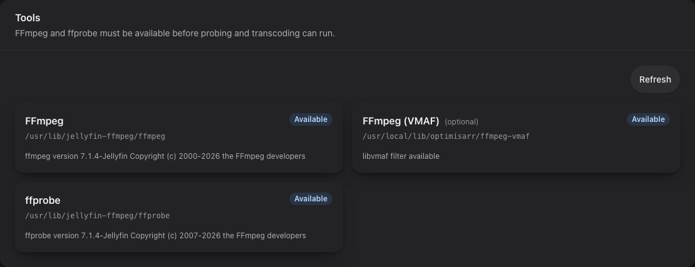

# Troubleshooting

## Start with health and logs

```bash
# Liveness: the web process is responding.
curl http://localhost:8787/api/health

# Readiness: SQLite, required writable paths, FFmpeg, and ffprobe are usable.
curl http://localhost:8787/api/ready
docker compose logs --tail=200 optimisarr
```

`/api/ready` returns `503` with a reason when Optimisarr cannot safely start
work. Check the reported path ownership/mount, database, or missing tool before
placing jobs in the queue. Docker's health check uses this readiness endpoint.

Use **Settings → System → Tools** to verify the required FFmpeg/ffprobe executables, the optional
`libvmaf` measurement capability, and the actual encoder test result. For a failed job,
open Queue details and read the FFmpeg error and verification report before retrying.
The Queue **Failures** tab and `GET /api/jobs/failures` also include failed preview and personal
quality comparisons. Each sample identifies its job type and returns structured failed verification
checks with the measured detail; closing the comparison removes its media but retains that small
diagnostic row until **Clear errored** is used.

Screenshots in this page use fabricated dummy media created for documentation.
No copyrighted material is used.



## Collect diagnostic evidence

Open **Settings → System → Diagnostic capture** before reproducing a problem. Choose
**1 hour**, **24 hours**, **7 days**, or **Until stopped**, optionally limited to one job.
The page lists online participants. Local capture requires protocol 10 sidecars; older
workers remain usable for media work but are identified as needing an update for local diagnostics.
**Include full media paths in the export** and **Continue recording after server restart**
are off by default. Even an **Until stopped** capture stops on restart unless that second
option was selected. A recording indicator remains visible throughout the application.

Choose **Stop and collect** to stop recording, allow online workers to send their final
records, and download a session bundle. Collection waits up to 35 seconds; an offline worker
or incomplete upload is explicitly listed in the manifest. **Stop capture** stops without
downloading. Expiry also stops recording. Sidecars renew consent on check-in and stop local
recording within 90 seconds of losing the server, or sooner at the disclosed expiry.


Select a retained capture to download it again, pin it, or delete an ended, unpinned capture.
Leaving **Job ID to export** empty downloads the session; optional time limits filter its
timeline by server receipt time. A job export includes that job's complete captured history.
Worker downloads filter the session timeline by worker. Related current job summaries can
contain context outside the selected time or worker filter. Queue job details separate current
verification from captured historical gates and provide **Copy issue summary**. The Failures
view also offers a direct download; when no capture exists, it opens capture settings.


### What the bundle establishes

Schema version **4** correlates job, execution attempt, parent job, worker, lease, sidecar
instance and local sequence. Server receipt IDs and timestamps provide ordering; worker
clock times are retained separately and may differ. Replay uploads do not duplicate events.
If a preview or comparison lease has been deleted, a bounded
`Worker.LeaseEvidenceUnavailable` marker acknowledges the missing evidence so later records
can still arrive. `Worker.JournalRecoveryIncomplete` discloses a corrupt or oversized local
journal; the number of lost records is unknown. These participants report collection with
omissions. Local exports also retain the recovery warning.
Attempt archive events preserve rejected reports even when a retry clears the current report.
New lease events freeze worker version, OS, architecture, protocol and advertised encoders;
sidecars record SHA-256 identities for their actual encoding, probe and measurement tools.
Missing hashes remain unknown. Existing leases identify worker metadata as
`CurrentWorkerRegistration`, which must not be mistaken for an attempt-time snapshot.

Captured evidence includes bounded verification outcomes, VMAF and audio-distance summaries,
source/candidate hashes and sizes, numeric stream/timestamp/decode summaries where available,
contract identities, scheduling hold reasons, transfer acknowledgements and replacement or
rollback outcomes. Policy snapshots are event-time values; saved contract hashes identify the
frozen worker contracts. These identities do not establish that verification passed. Current
lease evidence labels availability as `Available`, `Missing`, `Malformed`, or `Oversized`;
`Available` means readable evidence, not a passing verdict or an existing candidate file.
Legacy timing methods and tool identities that were never recorded remain unknown.

The manifest reference identifies the selected captured event history and export scope. It
is stable across repeated downloads of the same captured history; it is **not** a checksum
of mutable current-job context or the complete downloaded file. Share the JSON alongside the
copied summary when investigating an issue.

### Privacy, bounds and local recovery

Capture is off until explicitly started. A session stores at most 10,000 events and the chosen
64 KiB–16 MiB storage budget (the UI offers 1–16 MiB, default 4 MiB). At most 20 sessions are
retained. Routine retention defaults to seven days after capture ends, configurable from
1–30 days; a recorded failure defaults to 30 days, configurable up to 90 days and never below
routine retention. Pinning prevents automatic pruning. Cleanup runs at startup and every six
hours. A visible cap warning and manifest omissions explain incomplete history.

Session exports are bounded to 8 MiB, 200 job summaries and bounded attempts, leases and report
checks. If necessary, later events or job context are omitted with an explanation; select a
narrower time range for another export. Job bundles bound attempts to eight, leases to 500,
and current report checks to 100; frozen event reports retain up to 32 checks, prioritising
failures. The timeline displays the latest 100 captured records; downloads retain the bounded
history. These limits do not stop or weaken media verification.

Raw process text, commands, credentials, probe tags, viewer identities and media payloads are
excluded. Only canonical known tool-error phrases and typed measurements enter captured events.
Commands and saved contracts may be represented by hashes. Full paths require explicit opt-in;
review any export before sharing it publicly.

Each sidecar keeps a private local journal, bounded to 2,048 entries, 1 MiB and seven days.
Rotation counts records lost before acknowledgement; the bundle reports
`CollectedWithLocalOmissions` when a final upload discloses such a loss. Acknowledged records
remain locally exportable until local retention removes them. Local recovery never reactivates
recording without renewed consent. Use **Export local diagnostics…** in the Mac menu,
**Export local diagnostics… (administrator)** in the Windows tray, or the Linux sidecar's
**Export local diagnostics** link if the server is unavailable. Windows asks for administrator
access to read the protected service journal; cancelling the prompt leaves the worker running.
Local exports contain structured records and tool hashes, not the worker credential or raw logs.

This is an administrative feature. Protect remote UI/API access with an authenticated reverse
proxy or admin token. Bundles can reveal technical information about the media policy even
without full paths.

## Common causes

| Symptom | Check |
|---|---|
| `/api/ready` returns `503` | Read the JSON reason first. It usually points to an unwritable `/config`, `/work`, or `/trash` mount, a database migration/open failure, or missing FFmpeg/ffprobe. Fix readiness before queueing jobs. |
| Library cannot scan | Container path exists below `/data`; PUID/PGID can read it. |
| Replace fails / "cannot write" | The library folder must be writable by PUID/PGID. Optimisarr checks access when you add or save a library and again during scans; check the reported error and the mount ownership. |
| Replace/approve says dry-run mode is enabled | Dry-run mode is on under **Settings → Files & safety → Replacement and cleanup**. Jobs can still transcode and verify, but originals and quarantined originals are not moved or purged until dry-run is disabled. Expired failed `/work` outputs can still be cleaned because originals are untouched. |
| Jobs do not start | A library's auto-optimise window being closed (its jobs only run in-window), the concurrency limit, activity pause, or free `/work` space. The Queue shows a reason when a backlog is waiting on a window. |
| `/work` keeps growing | Set **Cleanup retention** above `0` and save. The panel shows what is currently reclaimable; **Clean up now** runs the same policy after confirmation. The startup/six-hour sweep also removes expired failed outputs while preserving their job reports and logs. Active and ready-to-replace outputs are never removed. |
| GPU mode unavailable | Device mapping/NVIDIA toolkit, group permissions, then Tools test encode. |
| Replacement cannot be atomic | Put `/data`, `/work`, and `/trash` on one filesystem or explicitly allow fallback. |
| No rollback available | Original may have been approved or purged by retention; restore from backup. |
| Config import is rejected | The import validates the whole JSON before writing. Check the listed field errors, especially unsupported settings from a newer build, invalid enum names, and auto-enqueue windows that are not `HH:mm`. |
| UI looks stale after updating the image | Refresh the browser tab first; `index.html` is served no-cache, but an already-open SPA can still be running old JavaScript until it reloads. If it persists, confirm the container was recreated and `docker compose logs --tail=200 optimisarr` shows the new startup. |

## Verification failures

Verification failures mean the original is still in place. Read the Queue detail
sheet before retrying:

- **Duration**, **tail integrity**, or **timestamp integrity** failures usually
  indicate a truncated or malformed output. In a personal quality check, inspect the structured
  failure details: the reference and candidate should describe the same requested sample window.
- **Audio retained**, **subtitle retained**, **A/V sync**, **loudness**, and
  **true peak** failures indicate stream or audio changes outside the configured
  policy. Preview and Personal quality video candidates are exactly trimmed after
  their bounded seek, so a remaining A/V sync failure is not accepted as ordinary
  long-GOP pre-roll.
- **Size reduction** failure means the output was not smaller than the original.
  Either leave the file alone or change the library rules deliberately.
- **VMAF** failures come from the video re-encode quality gate (enabled at the Visually lossless tier
  for new video re-encode libraries and configurable on the library page); image **SSIM/metadata** failures come from the default-on
  image gates. When a gate is enabled, a missing measurement fails closed, but an unmeasured VMAF
  result does not trigger a higher-quality re-encode or immediate automatic exclusion.
- **Source video timeline** means the original's primary audio materially outlasts its picture
  packets. Optimisarr leaves that source untouched and reports the inherited gap separately from an
  output-tail truncation. Subtitle, chapter, data, and attachment timelines do not trigger this
  failure because they may legitimately continue beyond the programme.

Use **Retry** only after changing the underlying cause: preset, hardware mode,
source file, mount access, or verification policy. Use **Exclude** for files you
do not want Optimisarr to offer again.
