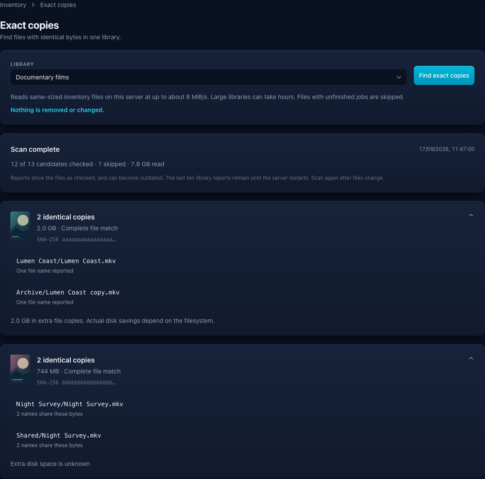

# Find exact file copies

**Inventory → Exact copies** finds files with identical complete bytes within one library.
It works with Film, TV, Music, Photo and Other libraries. Nothing is removed or changed.

1. Scan the library so its files appear in **Inventory**.
2. Open **Exact copies** and choose a **Library**.
3. Select **Find exact copies**. You can leave the page while the scan runs, or select
   **Cancel scan** to stop it.
4. Open a group to see its file locations and reported link counts.

This screenshot uses fabricated dummy media created for documentation. No copyrighted material
or real user library data is used.

## What the report means

Optimisarr compares the entire file using SHA-256, a content hash. Different tags, containers,
formats or encodes will not match, even if they play the same recording or show the same image.
Empty files and files with unique sizes do not need hashing. Files with unfinished jobs are
excluded from the candidate list. Changed, missing, unreadable or redirected paths are skipped.

**Extra file copies** counts logical file bytes beyond one copy when each checked file reports
one name. It is not a promise of recoverable disk space. Compression, shared filesystem blocks
and storage outside the selected library can affect actual savings. If any file has multiple
hard links or an unknown link count, the group shows **Extra disk space is unknown**.
Windows link counts are currently unknown.

Reports are snapshots from the time each file was checked. Scan again after files change.
The server keeps the last ten library reports in memory until restart; a new scan replaces
that library's previous report. Cancelling a scan does not publish a completed report.

## Cost and limits

Scans run only when requested. One scan runs across the application at a time, on the server,
with file reads capped near 8 MiB/s. This still uses disk and CPU; a large library can take hours.
No encode slot is reserved and verification placement is unchanged. Workers do not hash these
duplicate candidates in this first version.

This preview accepts at most 50,000 same-sized candidates in one library and displays at most
200 groups with 100 copies in each. A report also has a total budget of 2,000 copy locations and
500,000 path characters. Group headings retain their full copy count; shortened groups show
no extra-copy byte total. Completed scan
counts cover all accepted candidates, including groups beyond the display limit.

There are no removal, quarantine, automatic dedupe or hard-link conversion actions. Persistent
hash indexing, comparisons across libraries and similarity matching are on the
[roadmap](../roadmap.md).

If a file is skipped, check access and let its unfinished job complete, then scan the library
and try again. If another duplicate scan is running, finish or cancel that scan first.
