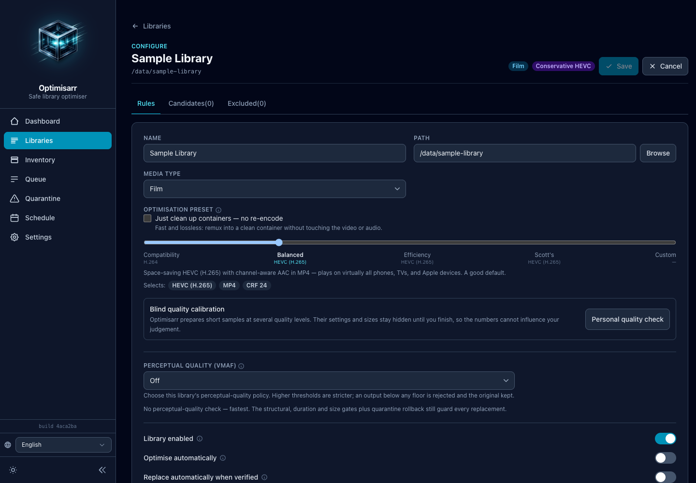
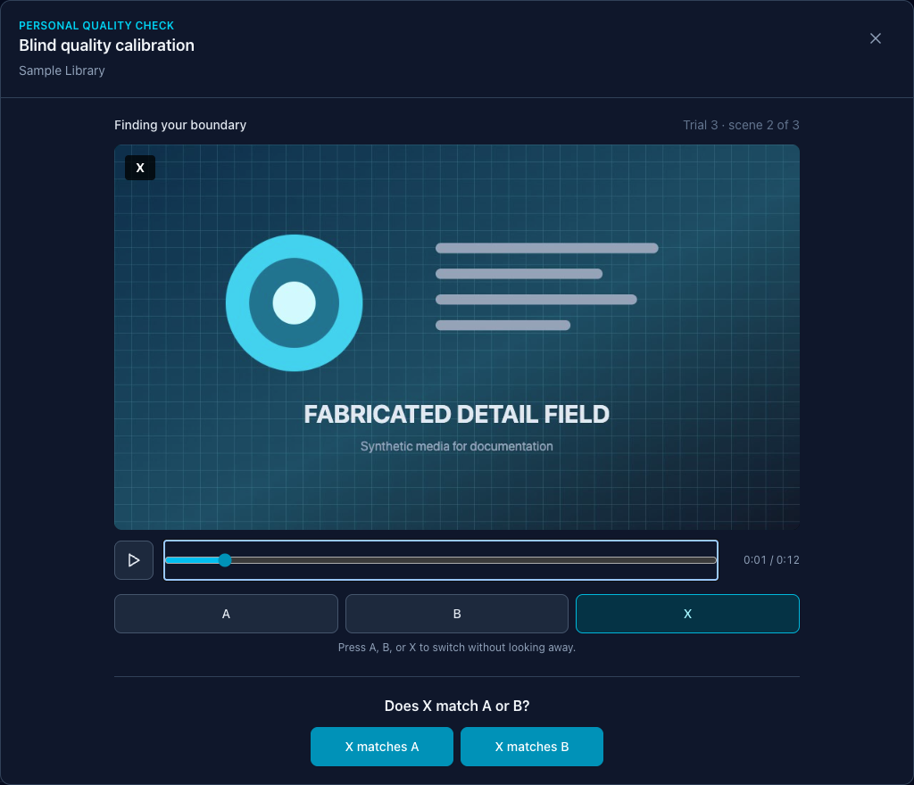
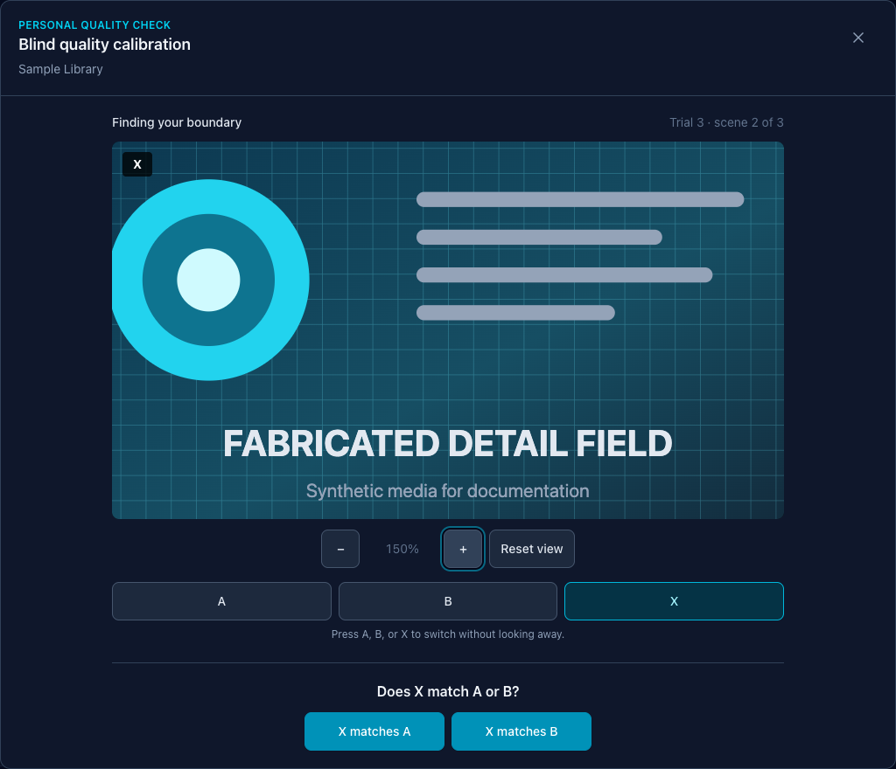

# Choose a personal quality setting

The **Personal quality check** helps you choose the most space-efficient video quality, audio
bitrate, or image quality that you cannot reliably distinguish from one representative source on
your own equipment.

It is a personal calibration aid, not proof that two encodes are identical. Repeat it with other
representative sources before treating one result as a rule for a varied library.

Screenshots in this guide use fabricated dummy media created for documentation. No copyrighted
material is used.

## Before you begin

You need:

- a saved Film, TV, Music, Photo, or Other library;
- at least one scanned and probed source in that library;
- enough free space under `/work` for the disposable samples; and
- the display, speakers or headphones, browser, viewing distance, and room conditions you normally
  use.

Video and audio sources must be long enough to provide three excerpts. Animated images and Dolby
Vision video are not offered. Save any changed library settings before opening the check; the button
stays disabled while the form has unsaved changes.

The source remains read-only. Optimisarr creates disposable work under `/work/calibration`; those
jobs cannot replace, move, or delete media and do not appear in the normal Queue.

## Start a check

1. Open **Libraries**.
2. Select **Configure** for the library you want to tune.
3. Find **Blind quality calibration** below the optimisation preset and select **Personal quality
   check**.
4. Choose a representative source. Prefer material that contains the detail, motion, texture,
   ambience, or tonal range you care about preserving.
5. Select **Prepare blind samples**.

Optimisarr prepares and structurally verifies every candidate before showing a comparison. You can
close the panel to cancel and clean up the session.

For HDR video, Optimisarr continues only when the library is configured to preserve HDR, the browser
reports an HDR-capable display path, and you confirm that the intended display is actually showing
HDR. Stop if the picture looks washed out or tone-mapped.

## Compare A, B, and X

Each trial asks whether X matches A or B. A/B/X assignments are randomised, and quality settings,
encoder details, and estimated savings remain hidden until the check is complete.

During a video or audio trial:

1. Select **A**, **B**, and **X** repeatedly. You can also press `A`, `B`, or `X` without looking
   away from the media.
2. Use the shared play button and timeline to revisit the same moment. Switching preserves the
   relative position.
3. Select **X matches A** or **X matches B** only after you have compared the details that matter to
   you.

Video checks compare only the primary picture stream, without audio. The player deliberately shows
one shared 0–12-second timeline instead of each file's native duration. This keeps hidden keyframe
pre-roll from identifying the original while presenting the same source frames on both sides.

Audio checks use three 15-second excerpts. Optimisarr measures both sides using EBU R128 integrated
loudness and attenuates only the louder stream during playback, so a volume jump cannot reveal the
answer. It never amplifies or rewrites a prepared sample for level matching.

For a still image, A/B/X share one viewport. Zoom or drag to inspect fine detail, then switch versions;
the same zoom and pan remain in place.

Answers stay disabled if any comparison stream fails to load or play. Try another supported browser
or source rather than guessing.

## Reveal and apply the result

After the screening and confirmation trials:

1. Select **Reveal result** to see the recommendation, actual setting, estimated saving, and answer
   count.
2. Read the result caveat. “No reliable difference” describes only this short test, source,
   equipment, observer, and environment.
3. Select **Use this quality for the library** only when you want to replace that library's saved
   video quality, audio bitrate, or image quality.

Applying the result changes one saved library setting. It does not scan, enqueue, replace, move, or
delete any media. Optimisarr refuses to apply a stale result if the library's relevant codec, preset,
or quality changed while the panel was open.

## What each media type tests

| Media | Prepared comparison | Applied setting |
|---|---|---|
| Video | Three 12-second scenes at several hidden quality levels, using only the primary picture stream. | Video CRF/CQ quality. |
| Audio | Three 15-second, loudness-matched excerpts across a codec-appropriate bitrate ladder. | Audio bitrate in kbps. |
| Still image | One lossless PNG reference and five hidden output-quality levels with synchronized zoom and pan. | Image quality. |

Film and TV libraries offer video sources, Music libraries offer audio sources, and Photo libraries
offer still images. An Other library can offer any supported, probed media it contains.

## If the check cannot continue

| What you see | What to do |
|---|---|
| **Personal quality check** is disabled | Save or discard the library's unsaved changes first. |
| No suitable source is ready | Scan and probe the library. Choose a longer video or audio file, or a non-animated still image. |
| HDR viewing check blocks preparation | Use an HDR-capable browser and display, confirm the display is presenting HDR, and keep the library's HDR handling set to Preserve. |
| **Calibration samples could not be prepared** | Check free space and write access for `/work`, then check **Settings → Tools** for FFmpeg, ffprobe, and encoder availability. Try a different source after correcting the reported failure. |
| The browser cannot play a comparison stream | Close the panel and retry with a browser that supports the configured codec, or use a different library codec/source. Answers remain disabled. |

Closing the panel removes its session and scratch media. Abandoned sessions expire after two hours,
and restarting Optimisarr discards all remaining calibration sessions.

For the underlying HTTP endpoints and blind-client requirements, see the [API reference](../api.md#personal-blind-quality-calibration).
