# Screenshot gallery

See the main application and its Mac, Windows and Linux sidecars before setting them up.
These 0.2.22 captures use fabricated dummy media created for documentation, original artwork,
invented machine names and example server addresses. No copyrighted material or private
library data is used. Readings illustrate the interface; they are not performance benchmarks.

## Main application

The Queue shows the current encode, its progress and the jobs waiting for review or replacement.
The server keeps authority over replacement and quarantine; workers return candidates and evidence.

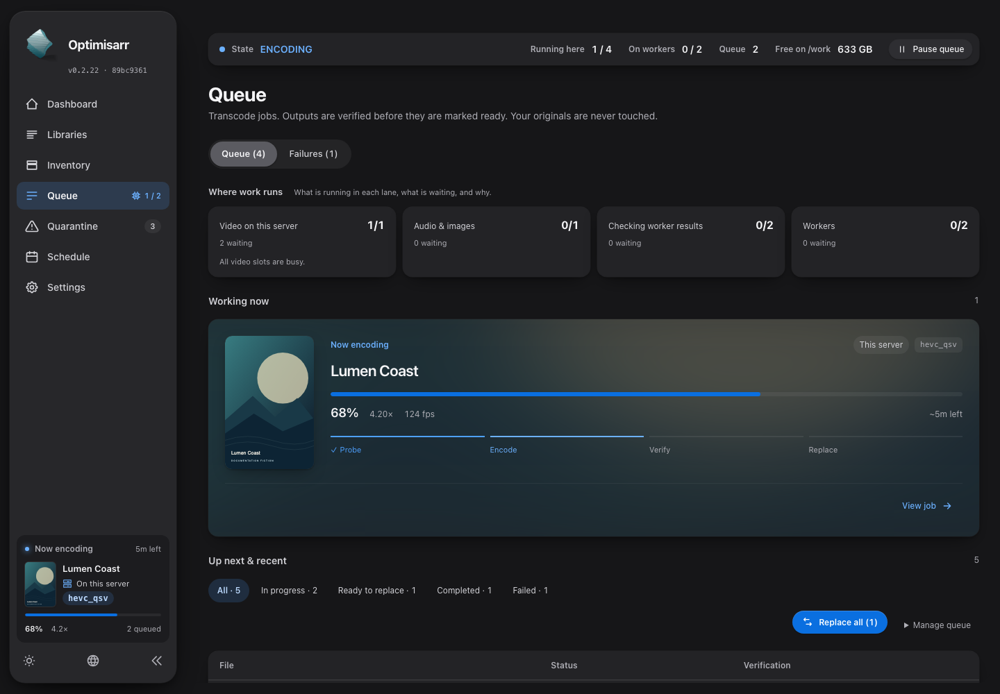

| Explore | What it shows |
|---|---|
| [Dashboard](../images/optimisarr-dashboard-dark.png) | Lifetime savings, recent results and service health. |
| [Libraries](../images/optimisarr-libraries-dark.png) | Media paths, presets and workflow controls. |
| [Inventory](../images/optimisarr-inventory-dark.png) | Discovered files and their media facts. |
| [Quarantine review](../images/optimisarr-quarantine-review-dark.png) | Original/candidate comparison and verification before a decision. |
| [Remote worker settings](../images/optimisarr-settings-workers-dark.png) | Pairing, capabilities and server-side worker controls. |
| [Personal quality check](../images/optimisarr-personal-quality-video-dark.png) | Anonymous candidates compared with the marked reference. |

See [the user workflow](workflow.md) for the steps behind these screens.

### Playback pauses and privacy

Queue and Schedule show posters and album covers beside the playbacks holding new work. The status strip links to Queue
for the full details, including on a phone. Names and devices can be hidden per media server.

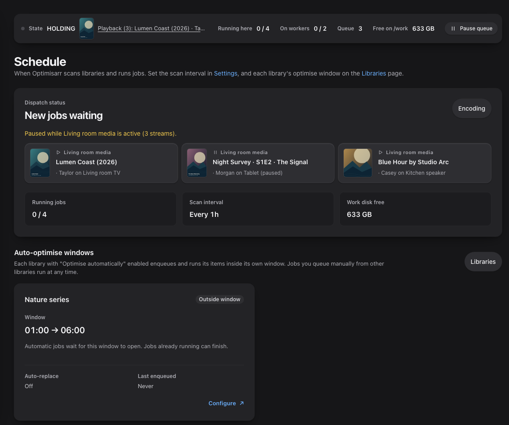

| Phone Queue | Titles only |
|---|---|
| 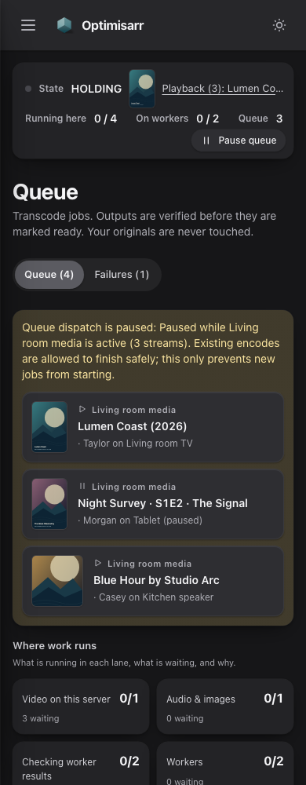 |  |

The saved connection confirms the privacy choice:

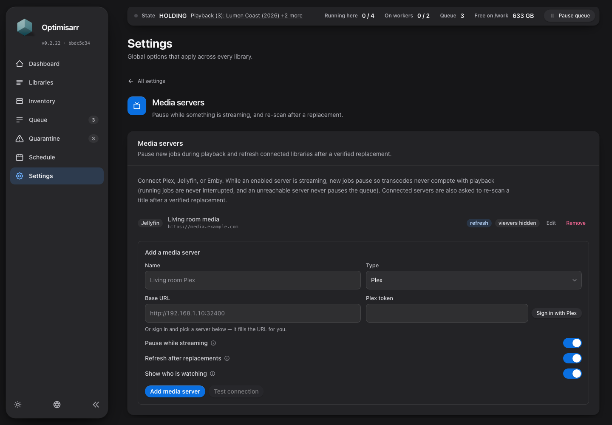

See [media-server settings](../integrations/media-servers.md#what-a-playback-pause-shows) for the
privacy control and a title-only Queue example.

## Sidecars

Mac and Windows use native desktop panels. Linux uses a browser dashboard hosted by the worker.
All three show work and available resource readings; missing telemetry stays unavailable.

### Mac menu bar

| Working, dark | Working, light |
|---|---|
| 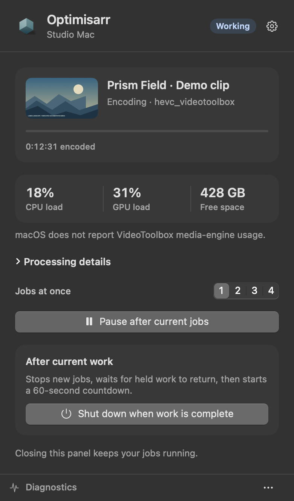 | 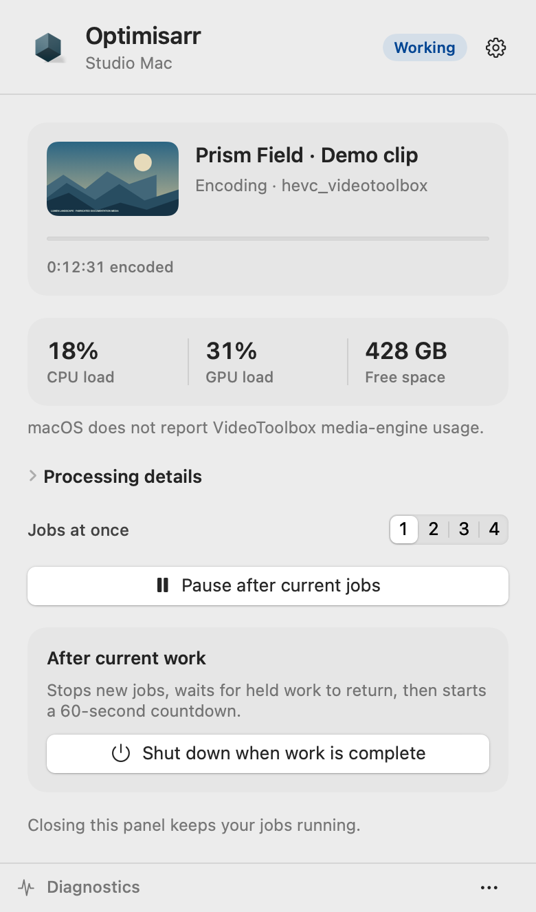 |

| Processing details | Preferences |
|---|---|
|  | 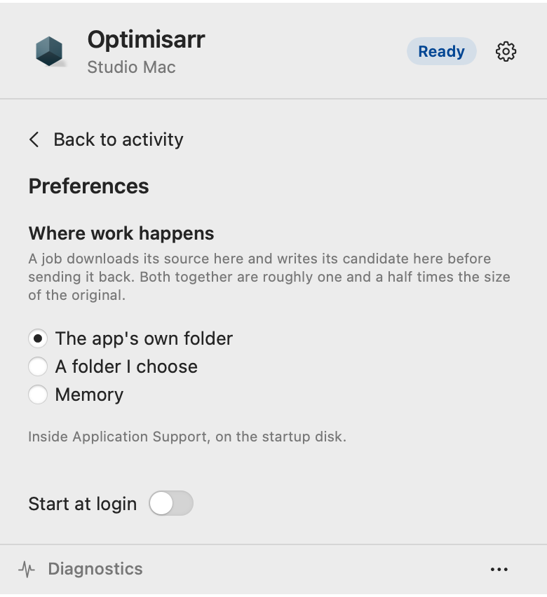 |

| State | Dark | Light |
|---|---|---|
| Ready for work | [Idle](../images/optimisarr-sidecar-macos-idle.png) | [Idle](../images/optimisarr-sidecar-macos-light-idle.png) |
| Before pairing | [Pairing](../images/optimisarr-sidecar-macos-pairing.png) | [Pairing](../images/optimisarr-sidecar-macos-light-pairing.png) |
| Two jobs | [Activity](../images/optimisarr-sidecar-macos-two-jobs.png) | [Activity](../images/optimisarr-sidecar-macos-light-two-jobs.png) |
| Audio with generated spectrum | [Audio](../images/optimisarr-sidecar-macos-audio.png) | [Audio](../images/optimisarr-sidecar-macos-audio-light.png) |
| Cancelable shutdown countdown | [Countdown](../images/optimisarr-sidecar-macos-shutdown.png) | [Countdown](../images/optimisarr-sidecar-macos-light-shutdown.png) |
| Processing details | Shown above | [Details](../images/optimisarr-sidecar-macos-light-details.png) |
| Preferences | [Preferences](../images/optimisarr-sidecar-macos-preferences.png) | Shown above |

These are actual native views rendered offscreen from the 0.2.22 UI with corrected capture fixtures. The renderer uses a flat
snapshot background and bordered controls; macOS 26 supplies glass in the live popover.
Indeterminate activity bars freeze in native snapshots; encoded time remains readable.
See the [Mac installation guide](../../sidecars/macos/README.md).

### Windows tray

| Working, dark | Working, light |
|---|---|
| 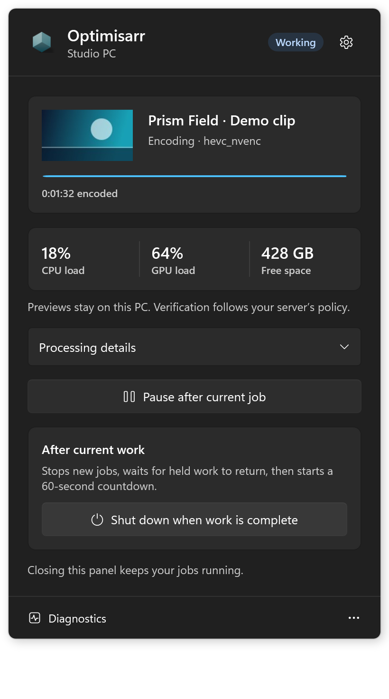 | 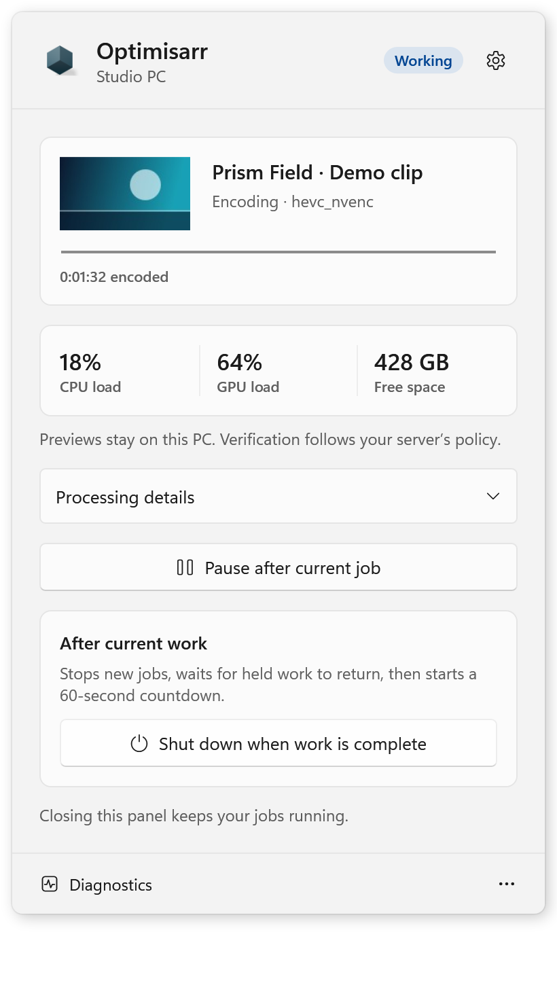 |

| Two jobs in Processing details | Preferences |
|---|---|
|  | 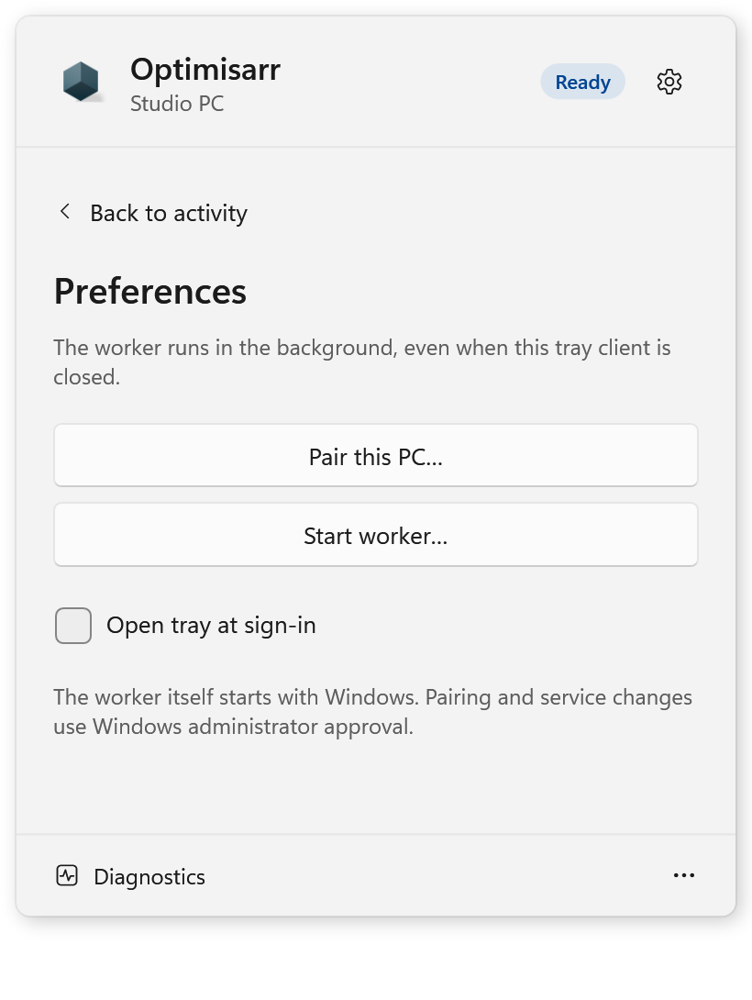 |

| State | Dark | Light |
|---|---|---|
| Ready for work | [Idle](../images/optimisarr-sidecar-windows-idle.png) | Not applicable |
| One job's Processing details | [Details](../images/optimisarr-sidecar-windows-details.png) | [Details](../images/optimisarr-sidecar-windows-light-details.png) |
| Two jobs | Shown above | [Activity](../images/optimisarr-sidecar-windows-light-two-jobs.png) |
| Audio with generated spectrum | [Audio](../images/optimisarr-sidecar-windows-audio.png) | [Audio](../images/optimisarr-sidecar-windows-audio-light.png) |
| Video preview unavailable | [Placeholder](../images/optimisarr-sidecar-windows-preview-fallback.png) | [Placeholder](../images/optimisarr-sidecar-windows-light-preview-fallback.png) |
| Cancelable shutdown countdown | [Countdown](../images/optimisarr-sidecar-windows-shutdown.png) | [Countdown](../images/optimisarr-sidecar-windows-light-shutdown.png) |
| Preferences | [Preferences](../images/optimisarr-sidecar-windows-preferences.png) | Shown above |

These are native WPF renders from the current Windows CI build. Audio shows the same generated
chirp spectrum as Mac and Linux. The video fallback is an icon placeholder. Indeterminate
activity bars freeze in native snapshots; they do not show a completion percentage. The background service
continues working when the tray closes. See the [Windows guide](../../sidecars/windows/README.md).

### Linux container

The worker page shows the source facts, progress, local preview, proved capabilities and recent
returns. Pairing happens here; scheduling, pause and drain controls stay on the main server.

| Light dashboard | Phone dashboard |
|---|---|
| 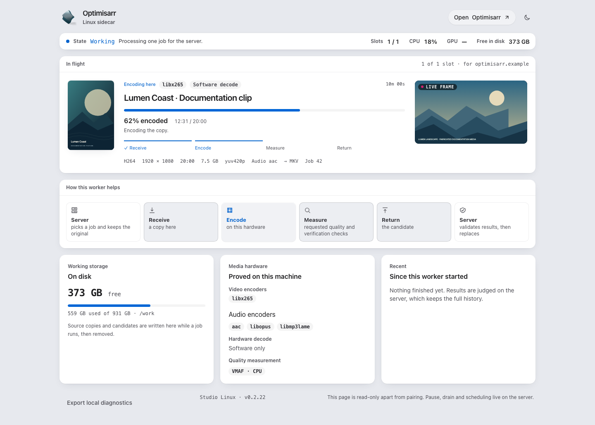 | 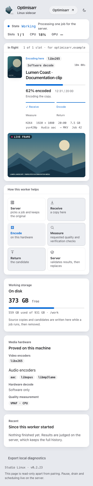 |

| State | Dark | Light | Phone |
|---|---|---|---|
| Pairing | [Pairing form](../images/optimisarr-sidecar-linux-pairing-dark.png) | [Pairing form](../images/optimisarr-sidecar-linux-pairing-light.png) | [Pairing form](../images/optimisarr-sidecar-linux-pairing-phone.png) |
| Ready for work | [Idle](../images/optimisarr-sidecar-linux-idle-dark.png) | [Idle](../images/optimisarr-sidecar-linux-idle-light.png) | [Idle](../images/optimisarr-sidecar-linux-idle-phone.png) |
| Audio with generated spectrum | [Audio](../images/optimisarr-sidecar-linux-audio-dark.png) | [Audio](../images/optimisarr-sidecar-linux-audio-light.png) | [Audio](../images/optimisarr-sidecar-linux-audio-phone.png) |

See [Linux container setup](../setup/linux-sidecar.md) and [worker placement and verification](../setup/remote-workers.md).

## Capture details

[Capture instructions and manifests](../images/README.md) record source versions, fixture data,
native-renderer limitations and repeatable commands. Dated review evidence is kept separately
and retains its original screenshots.

## Diagnostic capture

Explicit consent, bounded retention, final collection and local recovery are described in the
[diagnostic guide](../troubleshooting/diagnostics.md#collect-diagnostic-evidence).

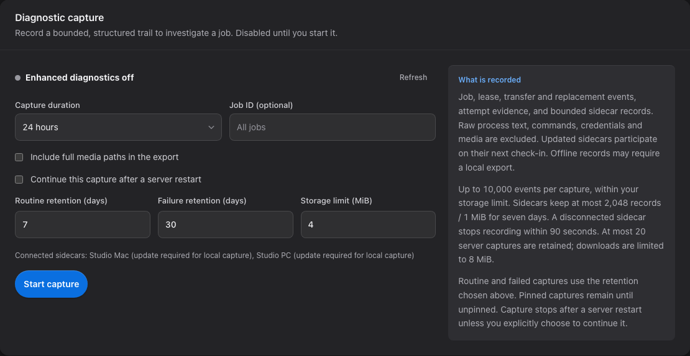

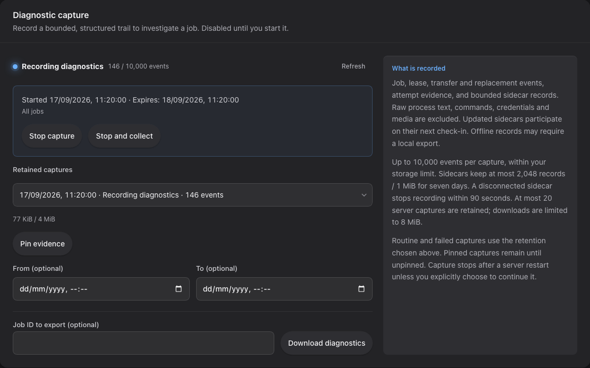

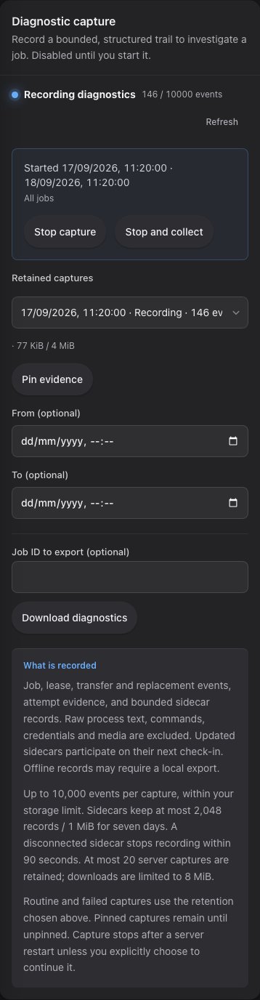
