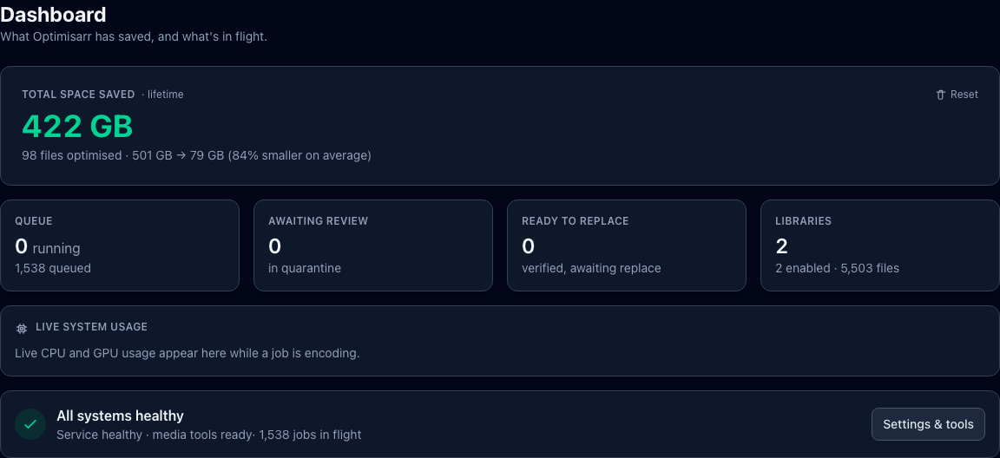
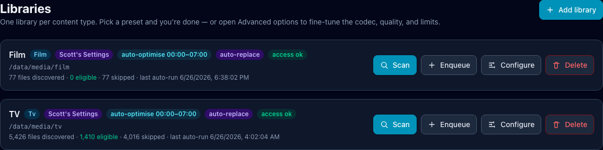
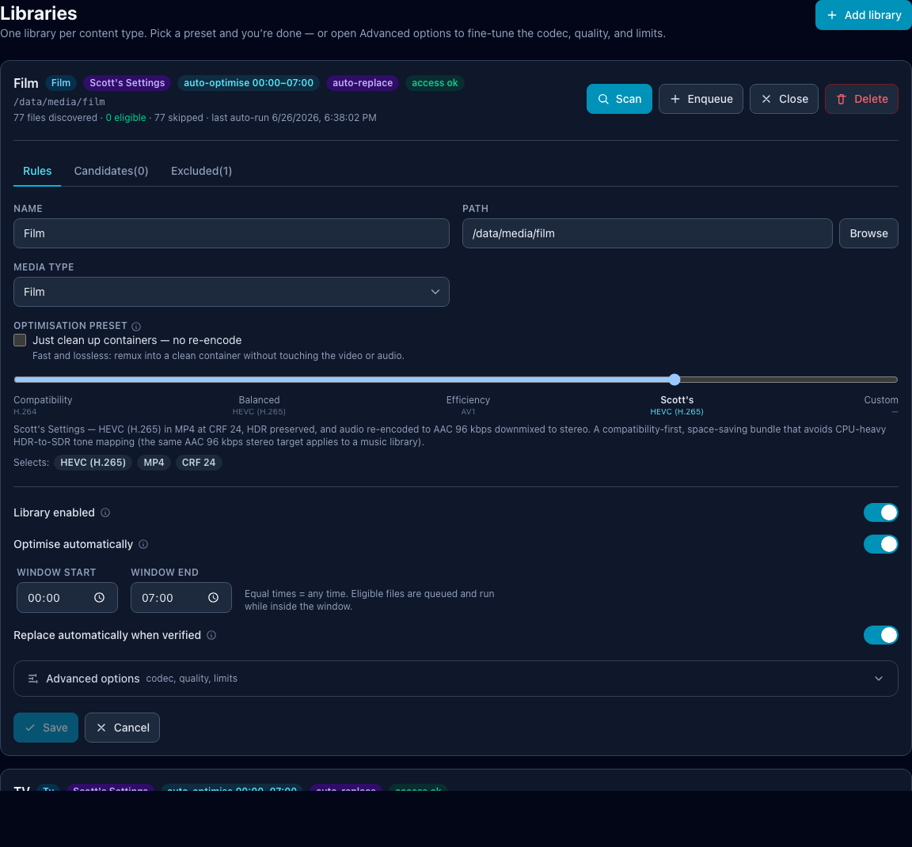
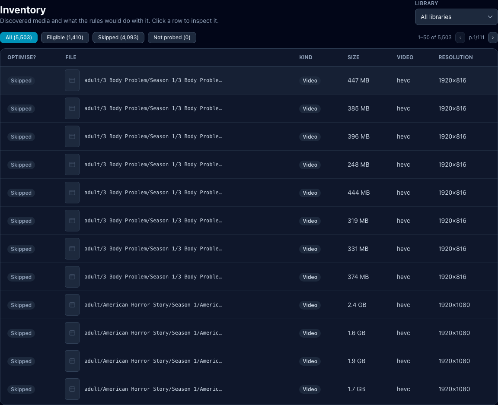
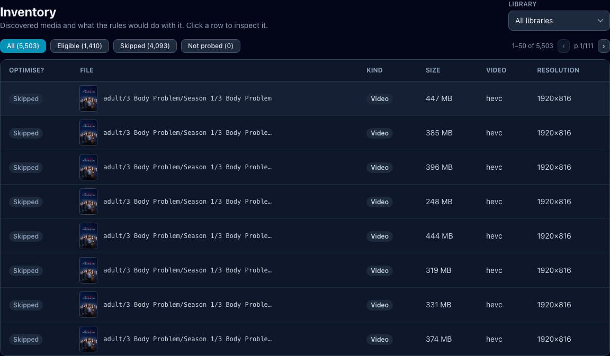
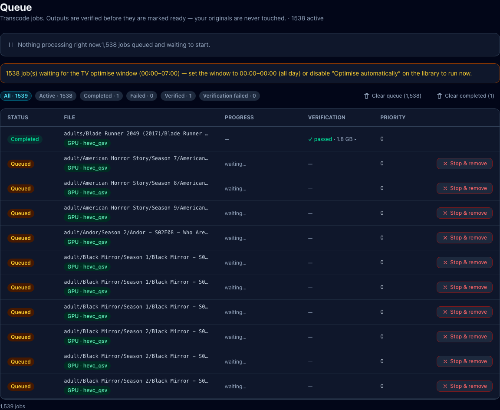
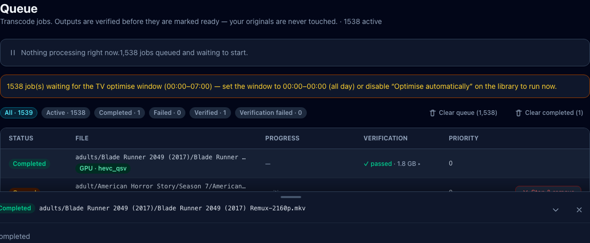
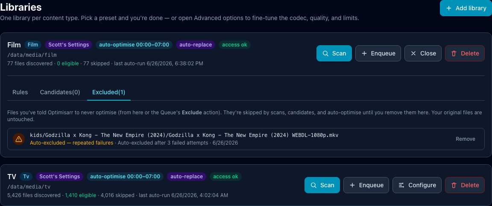
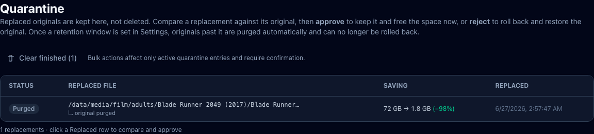

# User workflow

This walkthrough takes one small library from first scan to safe replacement.
Do this once manually before enabling automation.

```text
Dashboard -> Libraries -> Inventory -> Preview -> Queue -> Quarantine -> Automation
```

Keep **Dry-run mode** on for the first pass. Dry-run lets Optimisarr scan,
transcode, and verify, but it refuses actions that would move or purge originals.

Screenshots in this guide use fabricated dummy media created for documentation.
No copyrighted material is used.

## 1. Check the Dashboard

Start here after deployment or an update.



Do this:

1. Open Optimisarr.
2. Confirm **All systems healthy**.
3. Check the Queue, Ready to replace, and Libraries cards.

You should see a green health state before queueing work. If the health card is
not green, open **Settings → Tools** or run:

```bash
curl http://localhost:8787/api/ready
```

## 2. Add or review a library

A library is a folder plus rules. Start with one small Film, TV, Music, Photo,
or Other library.



Do this:

1. Go to **Libraries**.
2. Add a library or click **Configure** on an existing one.
3. Use a path as the container sees it, usually below `/data`.
4. Pick the media type.
5. Pick a preset.
6. Choose a perceptual-quality (VMAF) policy for video libraries. Leave it **Off**, select a named
   tier, or use **Custom** for all three quality floors, clip/full-file scoring, and frame sampling.
7. Leave advanced options closed unless you already know what you need.



Preset guide:

| Goal | Preset |
|---|---|
| Maximum playback compatibility | Compatibility H.264 |
| General space saving | Balanced / Conservative HEVC |
| Smallest files and slower encodes | Efficiency AV1 |
| Scott's compatibility-first setup | Scott's Settings |
| No re-encode, container cleanup only | Remux / cleanup |

VMAF policy guide:

| Goal | Library policy |
|---|---|
| Skip perceptual scoring for this library | Off |
| Prefer smaller outputs | Space-saver or Balanced |
| Protect high-value media more strictly | High, Visually lossless, or Archival |
| Tune exact floors and sampling cost | Custom |

The custom floors must remain ordered: catastrophic frame ≤ fifth percentile ≤ harmonic mean.
Scoring every frame and the full file is the strongest check; three representative samples and
every-Nth-frame scoring trade some coverage for faster verification.

For a more personal starting point, save an SDR video library and select **Personal quality check**
beside its optimisation preset. Choose a representative, probed file and let Optimisarr prepare the
short samples. During the blind A/B/X check, switch freely between A, B, and X, then answer whether
X matches A or B. Quality settings and estimated size remain hidden until you finish and select
**Reveal result**. A result means only that this check found no reliable difference for this person,
source, display, and viewing conditions. Select **Apply to this library** only if you want to replace
the library's saved quality value; no media is queued or replaced.

The personal check currently supports SDR video with a re-encode preset. It reads the original but
never changes it. Its clips are disposable and are cleaned up when the panel closes, after being
abandoned for two hours, or when Optimisarr restarts. If the browser cannot play every sample, the
panel disables answers rather than guessing.

You should see **access ok** on the library card. If not, fix the host mount,
`PUID`/`PGID`, or folder permissions before queueing jobs.

## 3. Scan the library

Scanning finds media files. Background probing reads stream details with
`ffprobe` so Optimisarr can explain what it will do.

Do this:

1. Click **Scan** on the library.
2. Wait for the discovered file count to update.
3. Open **Configure → Candidates** to see how the current rules classify files.


You should see each file marked **Eligible** or **Skipped** with a reason. A
skipped file is not an error; it often means the file is already in the target
codec, too small, excluded, outside a resolution limit, or cannot save space.

## 4. Inspect Inventory

Inventory is the safest place to understand your library before encoding.



Do this:

1. Go to **Inventory**.
2. Filter to your test library.
3. Click **Eligible** to see what would be queued.
4. Click **Skipped** to sanity-check why files are being ignored.
5. Open a row to inspect details before queueing.



You should understand why a file is or is not eligible before you queue it. If
the decision is surprising, change the library rules first and scan again.

## 5. Preview one representative file

Preview is a throwaway test encode. Use it before queueing many files.

Do this:

1. Open an eligible Inventory row.
2. Click **Preview**.
3. Compare original and encoded stats.
4. Read the verification report.

Long video previews encode a 60-second sample from the middle of the source and
mark the report as segment-only. Audio and image previews run in full. A preview
does not prove every file will pass, but it quickly catches bad presets, audio
choices, HDR handling, or quality thresholds.

## 6. Queue a small batch

Queue only a small test set until you trust the preset.



Do this:

1. Go back to **Libraries**.
2. Click **Enqueue** on the test library.
3. Open **Queue**.
4. Watch the status banner, filters, and job rows.

The Queue tells you why work is running or waiting. Common waiting reasons are a
closed auto-optimise window, an activity watcher pause, concurrency limits, or
low free space in `/work`.

Open a row when a job fails or finishes.



Use the row actions carefully:

- **Retry** after changing the cause of a failure.
- **Exclude** when you do not want that file offered again.
- **Remove** clears a queue entry when it is safe to clear.
- **Replace** appears only after verification passes and dry-run is off.

## 7. Review exclusions

Exclusions stop repeat failures from wasting time.



Files can be excluded manually from Queue, or automatically after repeated
failures. Remove an exclusion only when you want the file to become eligible
again.

## 8. Replace and review Quarantine

Replacement is the only point where the library path changes.



What happens during replacement:

1. The original moves to `/trash`.
2. The verified output moves into the library path.
3. Optimisarr records rollback metadata.
4. Connected media servers are asked to refresh.

In **Quarantine**:

- **Approve** keeps the replacement and permanently removes the quarantined
  original.
- **Reject** rolls back by restoring the original and removing the replacement.
- Retention can purge older originals automatically.

Quarantine is a rollback buffer, not a backup. Keep independent backups for
media and `/config/optimisarr.db`.

## 9. Enable automation last

Once a manual batch looks good, enable automation per library.

Use **Optimise automatically** when you want eligible files queued and started
inside a local-time window. Use `00:00` to `00:00` for all day.

Use **Auto-replace** only after you have reviewed successful jobs for that
library and preset. Auto-replace still verifies outputs and quarantines originals
first, but it removes the manual click between verification and replacement.

Keep dry-run on while testing automation if you want evidence without original
file changes.
